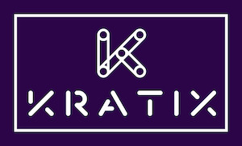

# Introducing Kratix 🎉

Before beginning this workshop, consider your answers to the following questions:

* What's the highest value service your platform provides to your application development teams? 
* How easy is it for you to provide and maintain that service?
* How easy is it for application developers to use that service?
* What are the possible opportunities available to you to enable your application developers better flow at a lower cost to you and your platform team.

This workshop introduces you to the [Kratix](https://www.kratix.io) framework. There is a series of tutorials that build up your understanding of what Kratix is, how Kratix works, and how Kratix can be tailored to your needs. 

## The series

1. [Quick Start: Install Kratix](/installing-kratix/) -- install Kratix using KinD
1. [Quick Start: Install a Kratix Promise](/installing-a-promise/) -- install a simple Jenkins Promise
1. [Using multiple Kratix Promises](/using-multiple-promises/) -- use Kratix with Promises for Knative, Postgres and Jenkins
1. [Writing and installing a Kratix Promise](/writing-a-promise/) -- use Kratix to deploy a Jenkins Promise that you write
1. [Enhancing a Kratix Promise](/enhancing-a-promise/) -- extend your Jenkins Promise with configuration specific to you, your team, and your organisation

Let's get started by [Installing a multi-cluster Kratix on KinD](/installing-kratix/).