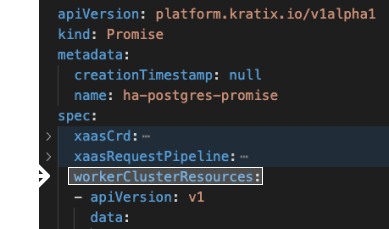
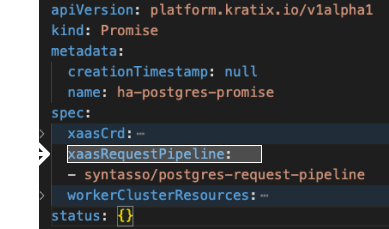

This is Part 5, the final hands-on part, of [a series](../README.md) illustrating how Kratix works. <br/>
👈🏾&nbsp;&nbsp; Previous: [Writing and installing a Kratix Promise](/writing-a-promise/) <br/>
👉🏾&nbsp;&nbsp; Next: [Final Thoughts](/final-thoughts/)

<hr> 

### In this tutorial, you will 
1. experience the power of leveraging customised Kratix Promises
1. grow confidence with the components of a Promise
1. enhance an off-the-shelf Postgres Promise

# Using Kratix to support your organisation

As [you've seen](/using-multiple-promises/README.md), Kratix can support off-the-shelf Promises for services like Jenkins, Knative, and Postgres. 

When you think about providing services for things like automation, deployment or data, how often are you able to choose a service (like Postgres) and offer it to your users straight off the shelf?

Probably not very often.

Application teams need to be able to easily run their services in different environments. They'll want specific sizes, particular backup strategies, defined versions, and more. Business stakeholders in many parts of the business need to be able to easily understand the state of service usage as it applies to them (hello audit, billing, and security!). 

Your team works with all of these users to understand the if, when, and how of each of these requests and creates a platform off the back of a prioritised backlog of platform features. 

This platform needs to be extensible and flexible&mdash;your users will have new and changing needs, and you'll want to quickly respond to valuable feature requests.

Kratix and Promises make it much easier to create a platform paved with high value, Golden Paths that deliver value easily and quickly. 

The exercise below is an example of creating and enhancing a Promise as a response to user and business needs.

<br>
<hr>
<br>

# From off-the-shelf to ready for the Golden Path

## Prerequisites
* [Install Kratix across two KinD clusters](/installing-kratix/)

## The scenario

In this exercise, you and the platform team are starting development of the next platform feature.

You spoke with application teams and you've decided to offer a new service. You'll be adding Postgres to your platform.

The billing team is a key stakeholder for the platform, and you know that, as always, their team will need a cost centre for each new instance of your Postgres service. They need to be able to charge back to the right team for billing. 

For the purposes of this exercise, you know that all of the underlying functionality to get the billing team what it needs is already in place. 

_Today, you only need create a new Postgres Promise that creates Postgres instances with a `costCentre` label._

<br/>
<!-- start step marker INTRO -->
<hr/>

## The steps:
1. Get a base Promise
1. Change the Promise so that _the user who wants an instance_ knows they need to include their `costCentre` name when they make their request to the platform
1. Change the Promise so that _the worker cluster_ Operator that creates the instance knows to apply our new `costCentre` label `costCentre`
1. Change the Promise so that _the pipeline_ knows how to add the user's `costCentre` to the request for the instance
1. Install the modified Promise on your platform
1. Check it works: make a request to your platform for a Postgres instance

<br/>
<!-- end step marker -->

<!-- start step marker ONE -->
<hr/>

## Step one: Get a base Promise
<!-- end step marker -->

Kratix has a sample Postgres Promise. You'll use that as your base. <br/>
<br/>
Clone the repository

```bash
git clone https://github.com/syntasso/kratix.git
```

Take a look
```bash
cd kratix/samples/postgres/
ls
```
<br/>

You should see the `postgres-promise.yaml` file. This is the Promise definition that you'll modify and install on your platform. Ignore everything else in the folder for now.

<br/>
<!-- start step marker TWO -->
<hr/>

## Step two: `xaasCrd`
> Change the Promise so that _the user who wants an instance_ knows they need to include their `costCentre` name when they make their request to the platform
<!-- end step marker -->

### About `xaasCrd`

`xaasCrd` is the CRD exposed to the users of the [Promise](../writing-a-promise/README.md). To see `xaasCrd` in the Promise definition file, open `postgres-promise.yaml` and look under the `spec` section.


`xaasCrd` is the contract with the user who wants an instance. It's where you get to define the required and optional configuration options exposed to your users.

You can already see a number of properties in this section of the `postgres-promise.yaml` file. These properties are defined within a versioned schema and can have different types and validations. 

### Update `xaasCrd`

To add the required cost centre configuration, add the following to the `postgres-promise.yaml`:

```yaml
costCentre:
  pattern: "^[a-zA-Z0-9_.-]*$"
  type: string
```
From the top of the file, navigate to 

`spec` > `xaasCrd` > `spec` > `versions`[0] > `schema` > <br/> `openAPIV3Schema` > `properties` > `spec`. 

Here, add your `costCentre` YAML from above as a sibling to the existing `preparedDatabases` property.


<details>
  <summary>👀&nbsp;&nbsp;Click here to view a final version of the extended `xaasCrd` which should be indented so as to nest under the `spec` header</summary>

```yaml
xaasCrd:
  apiVersion: apiextensions.k8s.io/v1
  kind: CustomResourceDefinition
  metadata:
    name: postgreses.example.promise.syntasso.io
  spec:
    group: example.promise.syntasso.io
    names:
      kind: postgres
      plural: postgreses
      singular: postgres
    scope: Namespaced
    versions:
    - name: v1
      schema:
        openAPIV3Schema:
          properties:
            spec:
              properties:
                costCentre:
                  pattern: "^[a-zA-Z0-9_.-]*$"
                  type: string
                preparedDatabases:
                  additionalProperties:
                    properties:
                      defaultUsers:
                        type: boolean
                      extensions:
                        additionalProperties:
                          type: string
                        type: object
                      schemas:
                        additionalProperties:
                          properties:
                            defaultRoles:
                              type: boolean
                            defaultUsers:
                              type: boolean
                          type: object
                        type: object
                    type: object
                  type: object
              type: object
          type: object
      served: true
      storage: true
```
</details>

<br/>
<!-- start step marker THREE -->
<hr/>

## Step three: `workerClusterResources`
> Change the Promise so that _the worker cluster_ Operator that creates the instance knows to apply our new `costCentre` label `costCentre`
<!-- end step marker -->

### About `workerClusterResources`

`workerClusterResources` is the description of all of the Kubernetes resources required to create an instance of the Promise, such as CRDs, Operators and Deployments. 

In the Promise definition, you divide resources based on the idea of _baseline capabilities_ and _per-instance resources_.  `workerClusterResources` is focused on the _baseline capabilities_. 

These capabilities are:
* created once per cluster.
* complete Kubernetes YAML documents stored in the `workerClusterResources` section of the Promise.



For the Postgres Promise you're defining, the only cluster resources (baseline capabilities) you need are conveniently packaged in a [Kubernetes Operator](https://github.com/zalando/postgres-operator) that is maintained by Zalando. The Operator turns the complexities of configuring Postgres into a manageable configuration format. 

### Update `workerClusterResources`

To make sure each Postgres instance includes `costCentre`, you need to make the Operator aware of the label. 

To ensure Zalando's Postgres Operator is aware of the label, you need to add configuration when installing the Operator. The configuration the Operator needs will be under a new key: [`inherited_labels`](https://github.com/zalando/postgres-operator/blob/master/docs/reference/operator_parameters.md#kubernetes-resources?:=inherited_labels). 

> ☝🏾&nbsp;&nbsp;&nbsp;Note that `inherited_labels` is unique to how Zalando's Postgres Operator works. If you were using a different Operator (or writing your own!), a different change may be required (or no change at all).

Following the Zalando [`docs`](https://github.com/zalando/postgres-operator/blob/master/docs/reference/operator_parameters.md#kubernetes-resources?:=inherited_labels), you need to add `inherited_labels` in a particular spot.

From the top of the file, navigate to 

`spec` > `workerClusterResources`[0] > `data` 

To verify you're in the right place, the object should be `kind: ConfigMap` with `name: postgres-operator`.

Under the `data` map, add `inherited_labels: costCentre` property **in alphabetical order**.

<details>
  <summary>👀&nbsp;&nbsp;Click here to see the complete `ConfigMap` resource after this change</summary>

```yaml
- apiVersion: v1
  data:
    api_port: "8080"
    aws_region: eu-central-1
    cluster_domain: cluster.local
    cluster_history_entries: "1000"
    cluster_labels: application:spilo
    cluster_name_label: cluster-name
    connection_pooler_image: registry.opensource.zalan.do/acid/pgbouncer:master-16
    db_hosted_zone: db.example.com
    debug_logging: "true"
    docker_image: registry.opensource.zalan.do/acid/spilo-13:2.0-p7
    enable_ebs_gp3_migration: "false"
    enable_master_load_balancer: "false"
    enable_pgversion_env_var: "true"
    enable_replica_load_balancer: "false"
    enable_spilo_wal_path_compat: "true"
    enable_team_member_deprecation: "false"
    enable_teams_api: "false"
    external_traffic_policy: Cluster
    inherited_labels: costCentre
    logical_backup_docker_image: registry.opensource.zalan.do/acid/logical-backup:v1.6.3
    logical_backup_job_prefix: logical-backup-
    logical_backup_provider: s3
    logical_backup_s3_bucket: my-bucket-url
    logical_backup_s3_sse: AES256
    logical_backup_schedule: 30 00 * * *
    major_version_upgrade_mode: manual
    master_dns_name_format: '{cluster}.{team}.{hostedzone}'
    pdb_name_format: postgres-{cluster}-pdb
    pod_deletion_wait_timeout: 10m
    pod_label_wait_timeout: 10m
    pod_management_policy: ordered_ready
    pod_role_label: spilo-role
    pod_service_account_name: postgres-pod
    pod_terminate_grace_period: 5m
    ready_wait_interval: 3s
    ready_wait_timeout: 30s
    repair_period: 5m
    replica_dns_name_format: '{cluster}-repl.{team}.{hostedzone}'
    replication_username: standby
    resource_check_interval: 3s
    resource_check_timeout: 10m
    resync_period: 30m
    ring_log_lines: "100"
    role_deletion_suffix: _deleted
    secret_name_template: '{username}.{cluster}.credentials'
    spilo_allow_privilege_escalation: "true"
    spilo_privileged: "false"
    storage_resize_mode: pvc
    super_username: postgres
    watched_namespace: '*'
    workers: "8"
  kind: ConfigMap
  metadata:
    name: postgres-operator
```
</details>
<br />

<br/>
<!-- start step marker FOUR -->
<hr/>

## Step four: `xaasRequestPipeline`
> Change the Promise so that _the pipeline_ knows how to add the user's `costCentre` to the request for the instance
<!-- end step marker -->

### About `xaasRequestPipeline`

`xaasRequestPipeline` is the pipeline that will take your user's request, apply rules from your organisation (including adding the `costCentre` name), and output valid Kubernetes documents for the Operator to run on a worker cluster.

Conceptually, a pipeline is the manipulation of an input value to generate an output value. There are three parts to a Kratix Promise request pipeline.



* `minimal-postgres-manifest.yaml`
* `execute-pipeline.sh`
* `Dockerfile`


You can see these files in the `request-pipeline-image` directory. You'll change two of these files so that the Promise's pipeline:

1. knows to include the `costCentre` _label_ in its output
1. knows to include your user's `costCentre` _actual value_ in its output

### Update the `minimal-postgres-manifest.yaml` to add in the property

The `minimal-postgres-manifest.yaml` is the pipeline basic template for the Postgres instance. This is a valid Kubernetes document that the Postgres Operator can understand.

You know every Postgres instance needs the `costCentre`. Change the metadata in `minimal-postgres-manifest.yaml` to include the `costCentre` label. This sets up a holding spot for the `costCentre` value the user sends in the request. 

```yaml
labels:
  costCentre: TBD
```

<details>
<summary>👀&nbsp;&nbsp;Click here for the complete metadata section</summary>

```yaml
metadata:
  name: TBD
  namespace: default
  labels:
    costCentre: TBD
```
</details>
<br />

### Update the `execute-pipeline.sh` to add in the user's value

The `execute-pipeline.sh` runs when Docker builds the image for the pipeline. This script is where the pipeline logic lives. 

You can see that the script is already parsing the resource request to identify key user variables (`name`, `namespace`, `preparedDatabases`). The script then uses [yq](https://github.com/mikefarah/yq) to add those user-provided values to the output document. You can do the same to process the user's `costCentre`. 

In the `execute-pipeline.sh`
1. Export another environment variable to store the value 
```bash
export COST_CENTRE=$(yq eval '.spec.costCentre' /input/object.yaml)`)
```
1. Add a new line for `yq` process the replacement as a part of the pipeline 
```bash
.metadata.labels.costCentre = env(COST_CENTRE) |
```

<details>
  <summary>👀&nbsp;&nbsp;Click here to view an example of the final script</summary>

```bash
#!/bin/sh

set -x

# Store all input files in a known location
cp -r /tmp/transfer/* /input/

# Read current values from the provided resource request
export NAME=$(yq eval '.metadata.name' /input/object.yaml)
export NAMESPACE=$(yq eval '.metadata.namespace' /input/object.yaml)
export COST_CENTRE=$(yq eval '.spec.costCentre' /input/object.yaml)
export PREPARED_DBS=$(yq eval '.spec.preparedDatabases' /input/object.yaml)

# Replace defaults with user provided values
cat /input/minimal-postgres-manifest.yaml |  \
  yq eval '.metadata.name = env(NAME) |
          .metadata.namespace = env(NAMESPACE) |
          .metadata.labels.costCentre = env(COST_CENTRE) |
          .spec.preparedDatabases = env(PREPARED_DBS)' - \
  > /output/output.yaml
```
</details>
<br />

#### Test the pipeline locally

You can easily validate your pipeline locally by building and running the Docker image with the correct volume mounts.

Check that you are still in the `kratix/samples/postgres` directory, and run the block below to:

1. create two directories inside `request-pipeline-image`: `input` and `output`
1. create expected input file (i.e., the request from your user)

```bash
cd request-pipeline-image
mkdir -p {input,output}
cat > input/object.yaml <<EOF
---
apiVersion: example.promise.syntasso.io/v1
kind: postgres
metadata:
  name: acid-minimal-cluster
  namespace: default
spec:
  costCentre: "rnd-10002"
  preparedDatabases:
    mydb: {}
EOF
```

Now test the pipeline by doing a Docker build and run. _Check that, per the step above, you are still in the `request-pipeline-image` directory._

```bash
docker build . --tag kratix-workshop/postgres-request-pipeline:dev
docker run -v ${PWD}/input:/input -v ${PWD}/output:/output kratix-workshop/postgres-request-pipeline:dev
```

Now you can validate the `output/output.yaml` file.

It should be the base manifest with all the custom values inserted. It should look like the example below. If your output is different, go back and check the steps from above and the files in the directory. Repeat this process until you're output matches the output below.

<details>
    <summary>👀&nbsp;&nbsp;Click here to view an example of expected output YAML</summary>

```yaml
apiVersion: "acid.zalan.do/v1"
kind: postgresql
metadata:
  name: acid-minimal-cluster
  namespace: default
  labels:
    costCentre: rnd-10002
spec:
  teamId: "acid"
  volume:
    size: 1Gi
  numberOfInstances: 2
  users:
    zalando: # database owner
      - superuser
      - createdb
    foo_user: [] # role for application foo
  databases:
    foo: zalando # dbname: owner
  preparedDatabases:
    mydb: {}
  postgresql:
    version: "13"
```
</details>
<br />

#### Give the platform access to your pipeline image

Once you have made and validated all the pipeline image changes, you will need to make the newly created `kratix-workshop/postgres-request-pipeline:dev` image accessible. 

You have [install Kratix across two KinD clusters](/installing-kratix/) as a prerequisite for the exercise. Because of that, you can take advantage of the fact that Kubernetes will always look for locally cached images first. 

Load the image into local caches by running the command below. This will stop any remote DockerHub calls.

```bash
kind load docker-image kratix-workshop/postgres-request-pipeline:dev --name platform
```

### Update the Promise's `xaasRequestPipeline` value

The new image is built and available on your platform cluster. Update your Promise to use the new image. 

Open the Promise definition file (`postgres-promise.yaml`). Update the `xaasRequestPipeline` to use your new image `kratix-workshop/postgres-request-pipeline:dev` instead of `syntasso/postgres-request-pipeline`.

<details>
  <summary>👀&nbsp;&nbsp;Click here to see the resulting xaasRequestPipeline section which should be indented under `spec` in the Promise yaml</summary>

```yaml
xaasRequestPipeline:
  -  kratix-workshop/postgres-request-pipeline:dev
```
</details>
<br />

<!-- start step marker FIVE -->
<hr/>

## Step five: Install
> Install the modified Promise on your platform
<!-- end step marker -->

You can now install your enhanced Postgres Promise on your platform. _Make sure you're in the `kratix/samples/postgres/` directory._

```bash
kubectl --context kind-platform apply --filename postgres-promise.yaml
```

Check that your Promise is available.

```console
kubectl --context kind-platform --namespace default get promises
```

Should return something like
```console
NAME                  AGE
ha-postgres-promise   1m
```

Check that the `workerClusterResources` have been installed. 

For Postgres, you can see in the Promise file that there are a number of RBAC resources, as well as a deployment that installs the Postgres Operator in the worker cluster. That means that when the Promise is successfully applied you will see the `postgres-operator` deployment in the worker cluster. That's also an indication that the Operator is ready to provision a new instance.

```console
kubectl --context kind-worker --namespace default get pods
```

Should return something like
```console
NAME                                 READY   STATUS    RESTARTS   AGE
postgres-operator-6c6dbd4459-hcsg2   1/1     Running   0          1m
```

You have successfully released a new platform capability! Your users can request a Postgres instance, and that instance will include their `costCentre`.

<!-- start step marker SIX -->
<hr/>

## Step six: Verify
> Check it works: make a request to your platform for a Postgres instance
<!-- end step marker -->

### Verifying your promise can be fulfiled

Switching hats to test your release, now act as one of your users to make sure the Promise creates working instances.

You need to create what Kratix calls a _resource request_, which is a valid Kubernetes resource. Like all Kubernetes resources, this  must include all [required fields](https://kubernetes.io/docs/concepts/overview/working-with-objects/kubernetes-objects/#required-fields):

1. `apiVersion` where the resource can be found. This is `example.promise.syntasso.io/v1` in your Postgres Promise (from `spec.xaasCrd.spec.group` in `postgres-promise.yaml`).
1. `kind`. This is `postgres` in your Postgres Promise (from `spec.xaasCrd.spec.name` in `postgres-promise.yaml`).
1. Values for required fields. Fields are `preparedDatabases` and `costCentre` in your Postgres Promise (from `spec` > `xaasCrd` > `spec` > `versions`[0] > `schema` > `openAPIV3Schema` > `properties` > `spec` > `properties` in `postgres-promise.yaml`).
1. A unique name and namespace combination.

In the sample _resource request_ (`postgres-resource-request.yaml`) add the additional `costCentre` field as a sibling to the `preparedDatabases` field with any valid input. For example, `costCentre: "rnd-10002"`.

<details>
<summary>👀&nbsp;&nbsp;Click here for the full Postgres resource request</summary>

```yaml
apiVersion: example.promise.syntasso.io/v1
kind: postgres
metadata:
  name: acid-minimal-cluster
  namespace: default
spec:
  costCentre: "rnd-10002"
  preparedDatabases:
    mydb: {}
```
</details>
<br />

Then apply the request file to the platform cluster:

```console
kubectl --context kind-platform apply --filename postgres-resource-request.yaml
```

On the worker cluster, you will eventually see a Postgres service as a two-pod cluster in the `Running` state with the name defined in the request (`postgres-resource-request.yaml`). In the next section, you'll run checks on the platform cluster.

```console
kubectl --context kind-worker get pods
```

Should return something like
```
NAME                                 READY   STATUS    RESTARTS   AGE
acid-minimal-cluster-0               1/1     Running   0          1h
acid-minimal-cluster-1               1/1     Running   0          1h
...
```

### Validating the created Postgres

Back as a platform engineer, you want to ensure that the platform and Promise behaved as it should when creating the instances and that the instances have met the reequirements for the feature.

After you applied the resource request in the step above, you should eventually see a new pod executing the `request-pipeline-image/execute-pipeline.sh` script you created. 

Check by listing the pods on the platform:

```console
kubectl --context kind-platform get pods
```

Should return something like
```console
NAME                                                     READY   STATUS      RESTARTS   AGE
request-pipeline-ha-postgres-promise-default-<SHA>       0/1     Completed   0          1h
```

Then view the pipeline logs by running _(with the SHA from the output of running `get pods` above)_:
```console
kubectl logs --container xaas-request-pipeline-stage-1 pods/request-pipeline-ha-postgres-promise-default-<SHA>
```

On the worker cluster, you will eventually see a Postgres service as a two-pod cluster in the `Running` state with the name defined in the request (`postgres-resource-request.yaml`):

```console
kubectl --context kind-worker get pods
```

Should return 
```
NAME                                 READY   STATUS    RESTARTS   AGE
acid-minimal-cluster-0               1/1     Running   0          1h
acid-minimal-cluster-1               1/1     Running   0          1h
...
```

For your friends in finance, the pods will provide cost tracking through your new `costCentre` label. This can be confirmed by only selecting pods that contain the provided cost centre value:

```console
kubectl --context kind-worker get pods --selector costCentre=rnd-10002
```

Should return
```
NAME                     READY   STATUS    RESTARTS   AGE
acid-minimal-cluster-0   1/1     Running   0          1h
acid-minimal-cluster-1   1/1     Running   0          1h
```

<!-- start step marker DONE -->
<hr/>

## Summary
<!-- end step marker -->

Your platform has a new Promise. Your users have access to a new service from the Promise. Your finance team has the ability to track service usage. Well done!

To recap the steps we took:
1. ✅&nbsp;&nbsp; Get a base Promise
1. ✅&nbsp;&nbsp;Change the Promise so that _the user who wants an instance_ knows they need to include their `costCentre` name when they make their request to the platform
1. ✅&nbsp;&nbsp;Change the Promise so that _the worker cluster_ Operator that creates the instance knows to apply the new `costCentre` label `costCentre`
1. ✅&nbsp;&nbsp;Change the Promise so that _the pipeline_ knows how to add the user's `costCentre` to the request for the instance
1. ✅&nbsp;&nbsp;Install the modified Promise on your platform
1. ✅&nbsp;&nbsp;Check it works: make a request to your platform for a Postgres instance

✅&nbsp;&nbsp; You have enhanced a Kratix Promise to suit your organisation's needs. This concludes our introduction to Kratix. <br/>
👉🏾&nbsp;&nbsp; Let's [see where to go from here](/final-thoughts/README.md).

