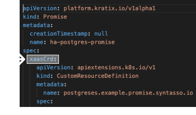

This is Part 5, the final hands-on part, of [a series](../README.md) illustrating how Kratix works. <br/>
👈🏾&nbsp;&nbsp; Previous: [Writing and installing a Kratix Promise](/writing-a-promise/) <br/>
👉🏾&nbsp;&nbsp; Next: [Final Thoughts](/final-thoughts/)

<hr> 

### In this tutorial, you will 
1. experience the power of leveraging customised Kratix Promises
1. grow confidence with the components of a Promise
1. enhance an off-the-shelf Postgres Promise

# Using Kratix to support your organisation

As [we've seen](/using-multiple-promises/README.md), Kratix can support off-the-shelf Promises for services like Jenkins, Knative, and Postgres. 

When you think about providing services for things like automation, deployment or data, how often are you able to choose a service (like Postgres) and offer it to your users straight off the shelf?

Probably not very often.

Application teams need to be able to easily run their services in different environments. They'll want specific sizes, particular backup strategies, defined versions, and more. Business stakeholders in many parts of the business need to be able to easily understand the state of service usage as it applies to them (hello audit, billing, and security!). 

Your team works with all of these users to understand the if, when, and how of each of these requests and creates a platform off the back of a prioritised backlog of platform features. 

This platform needs to be extensible and flexible&mdash;your users will have new and changing needs, and you'll want to quickly respond to valuable feature requests.

Kratix and Promises make it much easier to create a platform paved with high value, Golden Paths that deliver value easily and quickly. 

The exercise below is an example of creating and enhancing a Promise as a response to user and business needs.

<br>
<hr>
<br>

# From off-the-shelf to ready for the Golden Path

## The scenario

In this exercise, your team is starting development of the next platform feature.

You spoke with application teams and you've decided to offer a new service. You'll be adding Postgres to your platform.

The billing team is a key stakeholder for the platform, and you know that, as always, their team will need a cost centre for each new instance of your Postgres service. They need to be able to charge back to the right team for billing. 

For the purposes of this exercise, you know that all of the underlying functionality to get the billing team what it needs is already in place. 

_Today, you only need create a new Postgres Promise that creates Postgres instances with a `costCentre` label._

<!-- start step marker INTRO -->
<br/>
<hr/>

### The steps:
1. Get a base Promise
1. Change it so that _the user who wants an instance_ knows they need to include their `costCentre` name when they make their request to the platform
1. Change is so that _the worker cluster_ that creates the instance has the right stuff and does the right thing with `costCentre`
1. Change it so that _the pipeline_ knows how to add the user's `costCentre` to the request for the instance
1. Install the modified Promise on your platform
1. Check it works: make a request to your platform for a Postgres instance

<br/>
<!-- end step marker -->


<!-- start step marker ONE -->
<br/>
<hr/>

### Step one: base
1. ➡️ &nbsp;&nbsp;**Get a base Promise**
1. Change it so that _the user who wants an instance_ knows they need to include their `costCentre` name when they make their request to the platform
1. Change is so that _the worker cluster_ that creates the instance has the right stuff and does the right thing with `costCentre`
1. Change it so that _the pipeline_ knows how to add the user's `costCentre` to the request for the instance
1. Install the modified Promise on your platform
1. Check it works: make a request to your platform for a Postgres instance 

<br/>
<!-- end step marker -->
Kratix has a sample Postgres Promise. You'll use that as your base. <br/>
<br/>
Clone the repository

```bash
git clone https://github.com/syntasso/kratix.git
```

Take a look
```bash
cd kratix/samples/postgres/
ls
```
<br/>

You should see the `postgres-promise.yaml` file. This is the Promise definition that you'll modify and install on your platform. Ignore everything else in the folder for now.


<!-- start step marker TWO -->
<br/>
<hr/>

### Step two: `xaasCrd`
1. ✅&nbsp;&nbsp;~~Get a base Promise~~
1. ➡️ &nbsp;&nbsp;**Change it so that _the user who wants an instance_ knows they need to include their `costCentre` name when they make their request to the platform**
1. Change is so that _the worker cluster_ that creates the instance has the right stuff and does the right thing with `costCentre`
1. Change it so that _the pipeline_ knows how to add the user's `costCentre` to the request for the instance
1. Install the modified Promise on your platform
1. Check it works: make a request to your platform for a Postgres instance

<br/>
<!-- end step marker -->

As a refresher, a Promise consists of three parts:

* `xaasCrd`: the CRD exposed to the users of the [Promise](../writing-a-promise/README.md). <br/>
  📣&nbsp;&nbsp;&nbsp;**Here is where we will introduce a `costCentre` property so the user knows to put it in the request**
* `workerClusterResources`: the description of all of the Kubernetes resources required to create an instance of Postgres, such as CRDs, Operators and Deployments. 
* `xaasRequestPipeline`: the pipeline that will create the resources required to run Postgres on a worker cluster. Here is where we'll set the value for the `costCentre` label based on the user input.

So for this step we need to update `xaasCrd` in the definiton of our Promise (`postgres-promise.yaml`).

#### More about `xaasCrd`



`xaasCrd` is the contract with the user who wants an instance. It's where you get to define the required and optional configuration options exposed to your users.

You can already see a number of properties in this section of the `postgres-promise.yaml` file. These properties are defined within a versioned schema and can have different types and validations. 

In our case, we want to add a new required property called `costCentre` of type string and with a simple pattern requiring only certain character types. The complete property is as follows:

```yaml
costCentre:
  pattern: "^[a-zA-Z0-9_.-]*$"
  type: string
```

Add this cost centre property as a sibling to the existing `preparedDatabases` property. To navigate to the properties, open the `postgres-promise.yaml` file, then find the `xaasCrd` section and within the xaasCrd find the `v1` version which has a set of properties within the `openAPIV3Schema` spec.

<details>
  <summary>Click here to view a final version of the extended `xaasCrd` which should be indented so as to nest under the `spec` header</summary>

```yaml
xaasCrd:
  apiVersion: apiextensions.k8s.io/v1
  kind: CustomResourceDefinition
  metadata:
    name: postgreses.example.promise.syntasso.io
  spec:
    group: example.promise.syntasso.io
    names:
      kind: postgres
      plural: postgreses
      singular: postgres
    scope: Namespaced
    versions:
    - name: v1
      schema:
        openAPIV3Schema:
          properties:
            spec:
              properties:
                costCentre:
                  pattern: "^[a-zA-Z0-9_.-]*$"
                  type: string
                preparedDatabases:
                  additionalProperties:
                    properties:
                      defaultUsers:
                        type: boolean
                      extensions:
                        additionalProperties:
                          type: string
                        type: object
                      schemas:
                        additionalProperties:
                          properties:
                            defaultRoles:
                              type: boolean
                            defaultUsers:
                              type: boolean
                          type: object
                        type: object
                    type: object
                  type: object
              type: object
          type: object
      served: true
      storage: true
```
</details>


<hr/>

<!-- start step marker THREE -->
<br/>
<hr/>

### Step three: `workerClusterResources`
1. ✅&nbsp;&nbsp;~~Get a base Promise~~
1. ✅&nbsp;&nbsp;~~Change it so that _the user who wants an instance_ knows they need to include their `costCentre` name when they make their request to the platform~~
1. ➡️ &nbsp;&nbsp;**Change is so that _the worker cluster_ that creates the instance has the right stuff and does the right thing with `costCentre`**
1. Change it so that _the pipeline_ knows how to add the user's `costCentre` to the request for the instance
1. Install the modified Promise on your platform
1. Check it works: make a request to your platform for a Postgres instance

<br/>
<!-- end step marker -->

### Changing the cluster resources to include a new label

When installing a Promise, we divide resources based on the idea of baseline capabilities and per instance resources. In this section we are considering the baseline capabilities which are created once per cluster, these are complete Kubernetes YAML documents stored in the `workerClusterResources` section of the promise.

In the case of this Postgres Promise, the only cluster resources we need are contained within [Zalando's Postgres Operator](https://github.com/zalando/postgres-operator). This operator packages up the complexities of configuring Postgres into a manageable configuration format. In order to generate a Postgres instance from this operator that contains a custom cost label, we need to set a specific configuration option when installing the operator.

To use the custom label feature, we need to set any desired labels in the [`inherited_labels`](https://github.com/zalando/postgres-operator/blob/master/docs/reference/operator_parameters.md#kubernetes-resources?:=inherited_labels) option in the Operators config. The value is a comma delimited list of label keys that all instances created by the Operator are permitted to be set.

Note that this change is unique to how the underlying Postgres Operator works. If the "off the shelf" Promise was using a different Postgres Operator, a different change may be required (or no change at all).

To set this config, update the `workerClusterResources` section of the `postgres-promise.yaml` file by adding `inherited_labels: costCentre` in alphabetical order to the `ConfigMap` named `postgres-operator`.

<details>
  <summary>Click here to see a complete ConfigMap resource after this change</summary>

```yaml
- apiVersion: v1
  data:
    api_port: "8080"
    aws_region: eu-central-1
    cluster_domain: cluster.local
    cluster_history_entries: "1000"
    cluster_labels: application:spilo
    cluster_name_label: cluster-name
    connection_pooler_image: registry.opensource.zalan.do/acid/pgbouncer:master-16
    db_hosted_zone: db.example.com
    debug_logging: "true"
    docker_image: registry.opensource.zalan.do/acid/spilo-13:2.0-p7
    enable_ebs_gp3_migration: "false"
    enable_master_load_balancer: "false"
    enable_pgversion_env_var: "true"
    enable_replica_load_balancer: "false"
    enable_spilo_wal_path_compat: "true"
    enable_team_member_deprecation: "false"
    enable_teams_api: "false"
    external_traffic_policy: Cluster
    inherited_labels: costCentre
    logical_backup_docker_image: registry.opensource.zalan.do/acid/logical-backup:v1.6.3
    logical_backup_job_prefix: logical-backup-
    logical_backup_provider: s3
    logical_backup_s3_bucket: my-bucket-url
    logical_backup_s3_sse: AES256
    logical_backup_schedule: 30 00 * * *
    major_version_upgrade_mode: manual
    master_dns_name_format: '{cluster}.{team}.{hostedzone}'
    pdb_name_format: postgres-{cluster}-pdb
    pod_deletion_wait_timeout: 10m
    pod_label_wait_timeout: 10m
    pod_management_policy: ordered_ready
    pod_role_label: spilo-role
    pod_service_account_name: postgres-pod
    pod_terminate_grace_period: 5m
    ready_wait_interval: 3s
    ready_wait_timeout: 30s
    repair_period: 5m
    replica_dns_name_format: '{cluster}-repl.{team}.{hostedzone}'
    replication_username: standby
    resource_check_interval: 3s
    resource_check_timeout: 10m
    resync_period: 30m
    ring_log_lines: "100"
    role_deletion_suffix: _deleted
    secret_name_template: '{username}.{cluster}.credentials'
    spilo_allow_privilege_escalation: "true"
    spilo_privileged: "false"
    storage_resize_mode: pvc
    super_username: postgres
    watched_namespace: '*'
    workers: "8"
  kind: ConfigMap
  metadata:
    name: postgres-operator
```
</details>
<br />

### Updating the xaasRequestPipeline to use the new property

While the `xaasCrd` allows us to accept a custom cost centre ID as input, we will need to use our custom request pipeline to add the correct cost centre ID as a label for our finance team to track costs.

The Postgres request pipeline has three parts, which you can find in the `request-pipeline-image` directory:

* `Dockerfile`: the image Kratix will execute when a new Postgres gets requested.
* `execute-pipeline.sh`: the script that will be executed (see the contents of the Dockerfile), where any logic or substitution lives.
* `minimal-postgres-manifest.yaml`: a basic Postgres manifest that can be understood by the Postgres operator. That's the pipeline basic template for a Postgres instance.

We will in turn take a look at all those files.


#### Creating a label placeholder in the Postgres manifest

When a new Postgres is requested, we need to generate a `postgresql` resource. The template for this resource is stored as `minimal-postgres-manifest.yaml`. In order to allow customisation of a label, we first need to set the label in this template by updating the metadata. Go ahead and add the following under `metadata`, taking care that it's correctly indented:

```yaml
labels:
  costCentre: TBD
```

<details>
<summary>Click here for the complete metadata section</summary>

```yaml
metadata:
  name: TBD
  namespace: default
  labels:
    costCentre: TBD
```
</details>
<br />

This manifest file will act as the "input" to the request pipeline script where we will inject the user configuration into the pre-defined fields. Let's proceed in updating the script to do just that.
<br />

#### Setting the label value to user input via the pipeline

While the baseline capabilities have been updated to allow the new label key, we now need to edit the per instance resources to set the correct value for the label. These per instance resources are created when the platform users (the application developers) request the on-demand service so there can be zero to many per cluster and the resource YAML is generated via the `xaasPipeline` outputs.

As defined in the Dockerfile for the request pipeline, the `execute-pipeline.sh` script is where the pipeline logic lives. We need to update this script to read the user input and set the right resource label. Looking at the current logic, we can see we are already parsing our resource request to identify key user variables, then using [yq](https://github.com/mikefarah/yq) to process the template file and replace certain fields with the user inputted values.

Therefore, we can extend this script to also process the new cost centre ID. To do this, we will need to export another environment variable to store it (`export COST_CENTRE=$(yq eval '.spec.costCentre' /input/object.yaml)`) and a new line to process the replacement as a part of the pipeline (`.metadata.labels.costCentre = env(COST_CENTRE) |`).

<details>
  <summary>Click here to view an example of the final script</summary>

```bash
#!/bin/sh

set -x

# Store all input files in a known location
cp -r /tmp/transfer/* /input/

# Read current values from the provided resource request
export NAME=$(yq eval '.metadata.name' /input/object.yaml)
export NAMESPACE=$(yq eval '.metadata.namespace' /input/object.yaml)
export COST_CENTRE=$(yq eval '.spec.costCentre' /input/object.yaml)
export PREPARED_DBS=$(yq eval '.spec.preparedDatabases' /input/object.yaml)

# Replace defaults with user provided values
cat /input/minimal-postgres-manifest.yaml |  \
  yq eval '.metadata.name = env(NAME) |
          .metadata.namespace = env(NAMESPACE) |
          .metadata.labels.costCentre = env(COST_CENTRE) |
          .spec.preparedDatabases = env(PREPARED_DBS)' - \
  > /output/output.yaml
```
</details>
<br />

#### Testing the pipeline locally

Since a pipeline is just the manipulation of an input value to generate an output file, it can be easily validated locally by building and running the docker image with the correct volume mounts.

To set up this test, we will create two directories inside `request-pipeline-image`: `input` and `output`. Inside `input`, then we will add our expected input file (i.e., the resource request the app developer provides). From the `kratix/samples/postgres` directory, run the following:

```bash
cd request-pipeline-image
mkdir -p {input,output}
cat > input/object.yaml <<EOF
---
apiVersion: example.promise.syntasso.io/v1
kind: postgres
metadata:
  name: acid-minimal-cluster
  namespace: default
spec:
  costCentre: "rnd-10002"
  preparedDatabases:
    mydb: {}
EOF
```

Now we can build this image with a custom tag:

_(to run this command, make sure you are within the `request-pipeline-image` directory)_
```bash
docker build . --tag kratix-workshop/postgres-request-pipeline:dev
docker run -v ${PWD}/input:/input -v ${PWD}/output:/output kratix-workshop/postgres-request-pipeline:dev
```

And finally, we can validate the `output/output.yaml` file holds the manifest including all customised values. It should look like the example below. If your output is different, go back and check the files we touched. Repeat this process until you're satisfied with the output.

<details>
    <summary>Expected output.yaml</summary>

```yaml
apiVersion: "acid.zalan.do/v1"
kind: postgresql
metadata:
  name: acid-minimal-cluster
  namespace: default
  labels:
    costCentre: rnd-10002
spec:
  teamId: "acid"
  volume:
    size: 1Gi
  numberOfInstances: 2
  users:
    zalando: # database owner
      - superuser
      - createdb
    foo_user: [] # role for application foo
  databases:
    foo: zalando # dbname: owner
  preparedDatabases:
    mydb: {}
  postgresql:
    version: "13"
```
</details>
<br />

#### Accessing the new request pipeline container image from your cluster

Before moving on, you will want to make sure to have an environment ready to run Kratix. This includes having two clusters which can speak to each other, one named `platform` which includes both a Kratix and MinIO installation, and one called `worker` which includes a Flux CD installation with no other promises installed. Full instructions on how to do this can be found in the [Quick Start: Install Kratix](../installing-kratix/README.md), which is the first step in this series.

<details>
  <summary>Not sure if you are properly set up? Click here to see commands to verify a local KinD deployment</summary>

To verify your have at least the two necessary clusters:
```console
$ kind get clusters
platform
worker
```

To verify Kratix and MinIO are installed and healthy:
```console
$ kubectl --context kind-platform get pods --namespace kratix-platform-system
NAME                                                  READY   STATUS       RESTARTS   AGE
kratix-platform-controller-manager-769855f9bb-8srtj   2/2     Running      0          1h
minio-6f75d9fbcf-5cn7w                                1/1     Running      0          1h
```

To verify we can deploy resources to the worker, we can check if our "canary" resource has been deployed:
```console
$  kubectl --context kind-worker get namespaces kratix-worker-system
NAME                   STATUS   AGE
kratix-worker-system   Active   1h
```
</details>
<br />

Once you have made and validated all the pipeline image changes, you will need to make the newly created `kratix-workshop/postgres-request-pipeline:dev` image accessible by your platform. This can be tricky since you will not be able to push an image to an organisation you do not own (`kratix-workshop`).

If you are running a local local KinD cluster we can take advantage of the fact that Kubernetes will always look for locally cached images first. By running the following command, you will load the image into local caches which will therefore stop any remote DockerHub calls:

```bash
kind load docker-image kratix-workshop/postgres-request-pipeline:dev --name platform
```

Alternatively, if you need to pull from a remote source, you can re-tag the image with your own DockerHub repository and then push it for public use.

```bash
docker tag kratix-workshop/postgres-request-pipeline:dev <your-dockerhub-org>/postgres-request-pipeline:dev
docker push <your-dockerhub-org>/postgres-request-pipeline:dev
```

<!-- start step marker FOUR -->
<br/>
<hr/>

### Step four: `xaasRequestPipeline`
1. ✅&nbsp;&nbsp;~~Get a base Promise~~
1. ✅&nbsp;&nbsp;~~Change it so that _the user who wants an instance_ knows they need to include their `costCentre` name when they make their request to the platform~~
1. ✅&nbsp;&nbsp;~~Change is so that _the worker cluster_ that creates the instance has the right stuff and does the right thing with `costCentre`~~
1. ➡️ &nbsp;&nbsp;**Change it so that _the pipeline_ knows how to add the user's `costCentre` to the request for the instance**
1. Install the modified Promise on your platform
1. Check it works: make a request to your platform for a Postgres instance

<br/>
<!-- end step marker -->

#### Setting the xaasRequestPipeline image to our new custom image

Now that the new image is built and available in our platform cluster, we can update the Promise to use the new image. For that, open the `postgres-promise.yaml` and update the `xaasRequestPipeline` to use the `kratix-workshop/postgres-request-pipeline:dev` instead of the `syntasso/postgres-request-pipeline`.

<details>
  <summary>Click here to see the resulting xaasRequestPipeline section which should be indented under `spec` in the Promise yaml</summary>

```yaml
xaasRequestPipeline:
  -  kratix-workshop/postgres-request-pipeline:dev
```

</details>
<br />
<!-- start step marker FIVE -->
<br/>
<hr/>

### Step five: install
1. ✅&nbsp;&nbsp;~~Get a base Promise~~
1. ✅&nbsp;&nbsp;~~Change it so that _the user who wants an instance_ knows they need to include their `costCentre` name when they make their request to the platform~~
1. ✅&nbsp;&nbsp;~~Change is so that _the worker cluster_ that creates the instance has the right stuff and does the right thing with `costCentre`~~
1. ✅&nbsp;&nbsp;~~Change it so that _the pipeline_ knows how to add the user's `costCentre` to the request for the instance~~
1. ➡️ &nbsp;&nbsp;**Install the modified Promise on your platform**
1. Check it works: make a request to your platform for a Postgres instance

<br/>
<!-- end step marker -->
### Releasing the enhanced Promise to our platform

Once you have either loaded the image or updated your pipeline with the correct remote image, we are ready to install the Promise in our platform:

_(This command needs to be run from inside the `postgres` directory)_

```bash
kubectl --context kind-platform apply --filename postgres-promise.yaml
```

This promise has been successfully installed once the promise is available:

```console
$ kubectl --context kind-platform --namespace default get promises
NAME                  AGE
ha-postgres-promise   1m
```

And the `workerClusterResources` have been installed. These resources are what must be present in the clusters for an instance of our Promise to be successfully provisioned. They are installed as soon as the Promise is added to the platform.

For Postgres, we can see in the Promise file that there are a number of RBAC resources, as well as a deployment that installs the Postgres Operator in the worker cluster. That means that, when the Promise is successfully applied, we will see the `postgres-operator` deployment in the worker cluster. That's also an indication that the operator is ready to provision a new instance.

```console
$ kubectl --context kind-worker --namespace default get pods
NAME                                 READY   STATUS    RESTARTS   AGE
postgres-operator-6c6dbd4459-hcsg2   1/1     Running   0          1m
```

And that's it! You have successfully released a new platform capability! Let's move on to how teams can use this to request a new Postgres instance from the platform.

<!-- start step marker SIX -->
<br/>
<hr/>

### Step six: verify
1. ✅&nbsp;&nbsp;~~Get a base Promise~~
1. ✅&nbsp;&nbsp;~~Change it so that _the user who wants an instance_ knows they need to include their `costCentre` name when they make their request to the platform~~
1. ✅&nbsp;&nbsp;~~Change is so that _the worker cluster_ that creates the instance has the right stuff and does the right thing with `costCentre`~~
1. ✅&nbsp;&nbsp;~~Change it so that _the pipeline_ knows how to add the user's `costCentre` to the request for the instance~~
1. ✅&nbsp;&nbsp;~~Install the modified Promise on your platform~~
1. ➡️ &nbsp;&nbsp;**Check it works: make a request to your platform for a Postgres instance**

<br/>
<!-- end step marker -->

# App developer requesting Postgres

Until now, we have been acting as a platform engineer designing, updating, and releasing a new Promise to enhance our platform. With this Promise now available, we are going to take a moment to switch hats and have a look at what one of our application developers would do to take advantage of this new Promise.

## Submitting the resource request

As an application developer, we will need to create a resource request in the platform cluster. Like all Kubernetes resources, this request must include all [required fields](https://kubernetes.io/docs/concepts/overview/working-with-objects/kubernetes-objects/#required-fields):

1. An API that the resource can be found under. This is `example.promise.syntasso.io/v1` in our Postgres promise (see `spec.xaasCrd.spec.group` in the Promise manifest).
1. A kind which points to a specific promise. In this case it will be `postgres` (see `spec.xaasCrd.spec.name` in the Promise manifest).
1. A unique name and namespace combination.
1. Any required fields in defined the in our Promise `spec`. These can be found in the `xaasCrd` section of the Promise (more specifically under the `openAPIV3Schema` spec).

You can start with the provided sample `postgres-resource-request.yaml` and add the additional `costCentre` field as a sibling to the `preparedDatabases` field with any valid input. For example, `costCentre: "rnd-10002"`.

<details>
<summary>Click here for the full Postgres resource request</summary>

```yaml
apiVersion: example.promise.syntasso.io/v1
kind: postgres
metadata:
  name: acid-minimal-cluster
  namespace: default
spec:
  costCentre: "rnd-10002"
  preparedDatabases:
    mydb: {}
```
</details>
<br />

Then apply this file to the platform cluster with the following command:

```bash
kubectl --context kind-platform apply --filename postgres-resource-request.yaml
```

## Validating the created Postgres

As a platform engineer, we use our pipeline to support two different requirements when fulfilling the Postgres Promise.

Once the resource request is applied on the platform cluster, you should eventually see a new pod executing the pipeline script we just created. Listing the pods should output something similar to:

```console
$ kubectl --context kind-platform get pods
NAME                                                     READY   STATUS      RESTARTS   AGE
request-pipeline-ha-postgres-promise-default-<SHA>       0/1     Completed   0          1h
```

You can then view the pipeline logs by running:

_(make sure to update the pod SHA accordingly to the output of the `get pods` above)_

```bash
kubectl logs --container xaas-request-pipeline-stage-1 pods/request-pipeline-ha-postgres-promise-default-<SHA>
```

Once the pipeline is completed, you will eventually see on the worker cluster a Postgres service as a two pod cluster in `Running` state with the name we defined in our request:

```console
$ kubectl --context kind-worker get pods
NAME                                 READY   STATUS    RESTARTS   AGE
acid-minimal-cluster-0               1/1     Running   0          1h
acid-minimal-cluster-1               1/1     Running   0          1h
...
```

In addition, the pods will provide cost tracking for the finance team through a new label. This can be confirmed by only selecting pods that contain the provided cost centre value:

```console
$  kubectl --context kind-worker get pods --selector costCentre=rnd-10002
NAME                     READY   STATUS    RESTARTS   AGE
acid-minimal-cluster-0   1/1     Running   0          1h
acid-minimal-cluster-1   1/1     Running   0          1h
```
<!-- start step marker DONE -->
<br/>
<hr/>

### Summary: done!
1. ✅&nbsp;&nbsp;~~Get a base Promise~~
1. ✅&nbsp;&nbsp;~~Change it so that _the user who wants an instance_ knows they need to include their `costCentre` name when they make their request to the platform~~
1. ✅&nbsp;&nbsp;~~Change is so that _the worker cluster_ that creates the instance has the right stuff and does the right thing with `costCentre`~~
1. ✅&nbsp;&nbsp;~~Change it so that _the pipeline_ knows how to add the user's `costCentre` to the request for the instance~~
1. ✅&nbsp;&nbsp;~~Install the modified Promise on your platform~~
1. ✅&nbsp;&nbsp;~~Check it works: make a request to your platform for a Postgres instance~~

🎉&nbsp;&nbsp;&nbsp;&nbsp;🎉&nbsp;&nbsp;&nbsp;&nbsp;🎉&nbsp;&nbsp;&nbsp;&nbsp;🎉

<br/>
<!-- end step marker -->


In this workshop, we explored the components that make up a Kratix Promise. We then customised an "off the shelf" Postgres promise, tailoring it to our specific organisation needs before providing it on our platform.

We started by extending the Promise's `xaasCrd`, which acts as the contract between the platform team and their users, to accept a new property: `costCentre`. We defined its type and added some basic validations using the Schema object in the OpenAPI V3 specification.

We set a property on the Postgres Operator to add this custom `costCentre` label onto all resources it creates. This Operator is how the platform team standardises the creation of Postgres instances for each application development team. Part of our platform design is deciding which of these properties are exposed to our users, and which are set as standard for all Postgres instances created.

Once the Promise's contract was updated to accept the `costCentre` property, and the Postgres Operator was updated to use a custom label, we moved our attention to the Promise's `xaasRequestPipeline`. In our example, we updated the pipeline script to set a new label on the resulting postgres based on the user's `costCentre` input.

We then switched hats and, as a member of an application development team, sent out a resource request for a new Postgres instance. The request was straightforward, we only had to add the new required property to the `spec` session of our resource requests.

Finally, we observed how everything works together by validating the a new Postgres instance was eventually created in our worker cluster, and that it had the right labels. We could now use whatever system we currently have in place to charge the cost centre for this new resource.


✅&nbsp;&nbsp; You have enhanced a Kratix Promise to suit your organisation's needs. This concludes our introduction to Kratix. <br/>
👉🏾&nbsp;&nbsp; Let's [see where to go from here](/final-thoughts/README.md).

