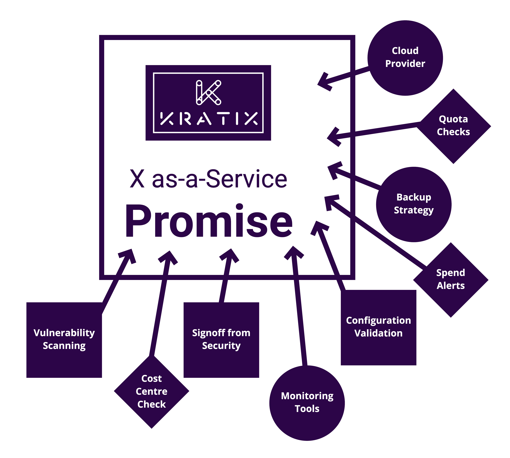
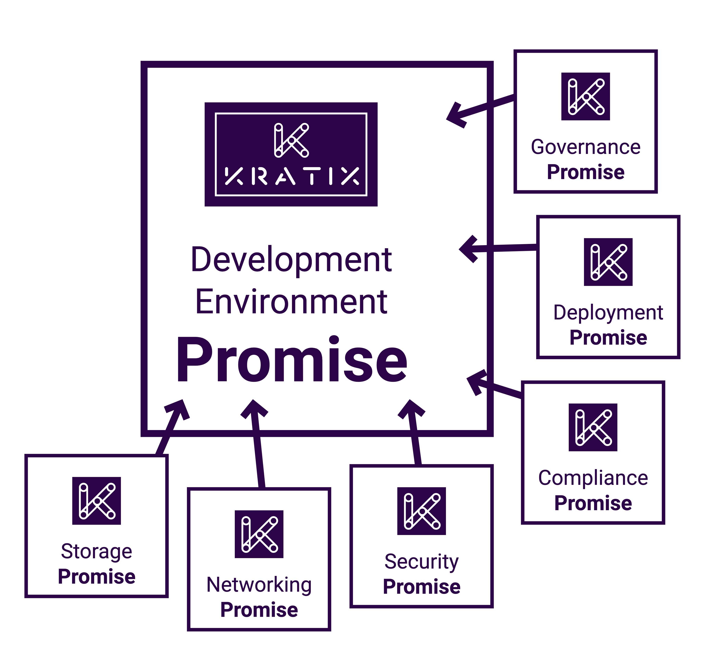

👈🏾&nbsp;&nbsp; Previous: [Enhancing a Kratix Promise](/enhancing-a-promise/)  

# What's next?

Our last hands-on session went through how to [enhance a Postgres Promise](/enhancing-a-promise/README.md). 

What about further enhancements? What about more Promises?

## Designing the right Promise for a single service

Platform teams in any form add tremendous value to an organisation. They reduce cognitive load for application teams, which enables those teams to have faster 'flow'. 

However, reducing cognitive load for application teams generally, in our experience, increases toil for platform team members. The closer a platform team gets to effective enablement of application teams, the higher the likelihood is that behind the scenes, platform team members are stretched beyond capacity. 

Here is an experience you might have on a platform team as you work to support your application teams who need data storage for their applications.

What you aim to deliver is:

### A standardised development tool...
But through a Slack message, you happen to learn that four application teams are all using four different flavours of Postgres. Each team's database is in a different cloud, each has a different backup strategy, and each uses different levels of monitoring.

### ...optimised for scale...
However after learning about the four 'shadow IT' Postgres databases, you poll application teams and realise the problem is bigger than you thought. Now you need to manually intervene in each team's backlog to audit the situation and ensure each database is healthy and compliant. 

### ...pre-configured to meet your business requirements...
Requirements are fixed, but you have to deal with the nuance in each type of Postgres. So you have to manually enforce quotas via your audits at the end of each month; manually reconcile service instances, teams, and billed cost centres; and manually inform interested stakeholders when costs change.

### ...and automatically secured according to your policies.
Security is complex, and each Postgres defines their security details in different places. So you need to manually verify that each Postgres configuration is acceptable according to the broader security protocols; manually make sure proper signoff has happened before deployments move forward; and manually run third-party software against code that is being shipped to make sure dependecies don't have vulnerabilities.
 
 

This example has _a lot_ of platform concerns, and we've only listed a few.

With Kratix you can develop a platform that will easily _offer standardised development tools_, _optimised for scale_, that is _pre-configured to meet your business requirements_ and _secured according to your policies_.

Stepping back, the beauty of Kratix is in its flexibility. It allows you to encapsulate a service in a Promise with a robust Request Pipeline. Our example above highlights some of the most common challenges where Kratix has helped platform teams we've worked with move past toil toward higher-value enablement. But we know your organisational challenges are unique, and Kratix is built so that you can adapt it to your context.

## Designing the right Golden Paths with multiple Promises

The value of your platform increases dramatically when you offer application teams tailored Golden Paths. A [“Golden Path”](https://www.syntasso.io/post/paving-golden-paths-on-multi-cluster-kubernetes-part-1-the-theory) is the opinionated and supported path to “build something”. Imagine a complete development environment setup&mdash;networking, integration, security, governance, compliance, and deployment&mdash;all available on-demand. By paving a Golden Path the platform team makes doing the right thing easy for application teams.

Creating a Golden Path on Kratix is easy: decide on, define, and install the individual Promises that are required, then define a higher-level Promise that brings those individual Promises together. 

An application developer goes from making separate Kratix Resource Requests to get access to separate service instances to being able to make one single Resource Request to get pre-configured, ready-to-go instances of everything they need. 

We believe composable Promises are at the core of the value that Kratix provides to platform teams. 

Take a moment to imagine the most valuable bundle of services that your platform could offer to your application teams. Now that you've had experience building a platform with Kratix, translate that bundle of services into a composed Promise using Kratix. 

## Learn more 
If the idea of treating your platform as-a-Product is new concept to you, watch this short talk by [Paula Kennedy](https://twitter.com/PaulaLKennedy) at Devoxx UK: [Crossing the Platform Gap](https://youtu.be/pAk5GReIs90) or read our two-part series about [Paving Golden Paths](https://www.syntasso.io/post/paving-golden-paths-on-multi-cluster-kubernetes-part-1-the-theory) on the Syntasso blog.

## Get in touch
💭&nbsp;&nbsp; If learning about Kratix and platforms as products sounds intriguing and you'd like to chat with us, we'd love to hear from you. Please reach out on https://www.syntasso.io/contact-us.
