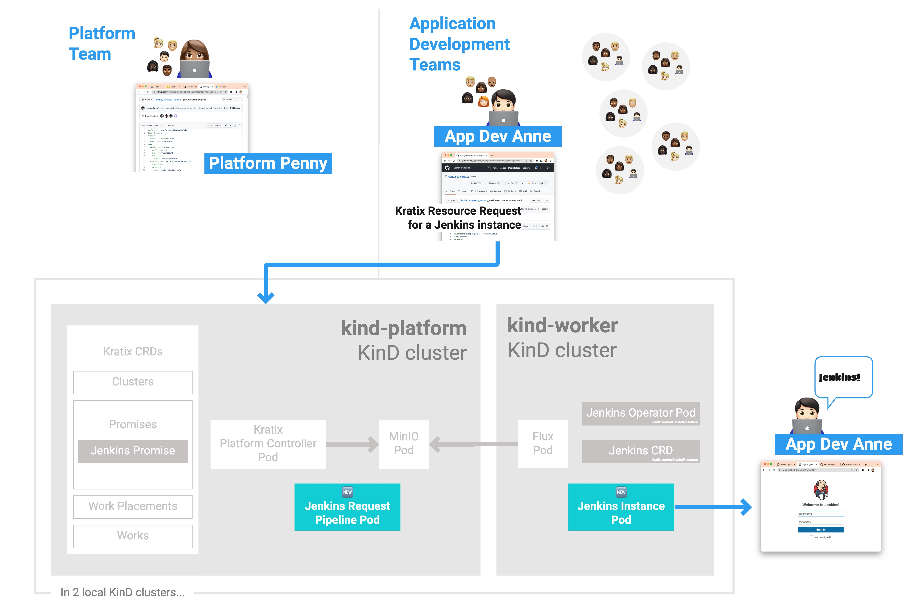
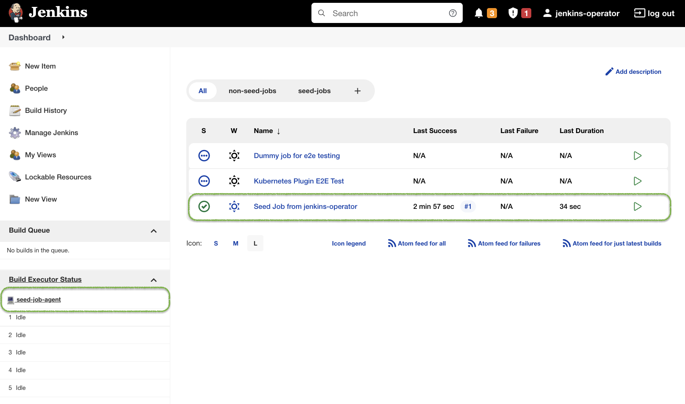

This is Part 2 of [a series](../README.md) illustrating how Kratix works. <br/>
👈🏾&nbsp;&nbsp; Previous: [Quick Start: Install Kratix](/installing-kratix/) <br/>
👉🏾&nbsp;&nbsp; Next: [Using multiple Kratix Promises](/using-multiple-promises/)

<hr>

### In this tutorial, you will
1. [learn more about Kratix Promises](#promise)
1. [install Jenkins as a Kratix Promise](#install-jenkins)

# <a name="promise"></a>What is a Kratix Promise?

If you are, or have been, a member of a platform team, you'll know how hard it can be. We've been platform team members, we've worked with many platform teams, and we've consistently experienced shared pains such as:

* Work is hard, but for the wrong reasons.
* Work involves managing tension from many teams, parts of the business, and key stakeholders.
* Customers or users expect software served from the platform to be as simple, quick to consume, and performant as commodity public-cloud services.

Kratix and Promises _exist_ to help platform teams to minimise these pains and deliver value more easily.

We described the Kratix framework in the [previous step](/installing-kratix/README.md), now we want to talk through the high-level capabilities and anatomy of a Kratix Promise.

Conceptually, Promises are the building blocks of Kratix that allow you to develop your platform incrementally. Technically, a Promise is a YAML document that defines a contract between the Platform and its users. We will explore more about this contract and the internals of a Kratix Promise in part 4 where you will [write your own Promise](/writing-a-promise/README.md).

## Kratix Promises

* enable you to build your platform incrementally and in response to the needs of your users.
* codify the contract between platform teams and application teams for the delivery of a specific service, e.g. a database, an identity service, a supply chain, or a complete development pipeline of patterns and tools.
* are easy to build, deploy, and update.
* are sharable and reusable between platforms, teams, business units, and other organisations.
* add up to a frictionless experience when platform users want to create services that they need to deliver value.

Now that you know more about Kratix Promises, follow the steps below to install a Promise.

<br>
<hr>

## <a name="prerequisites"></a>Prerequisites
You need a fresh installation of Kratix for this section. The simplest way to do so is by running the quick-start script from within the Kratix directory.

You can run this command from the root of `kratix`:

```bash
./scripts/quick-start.sh --recreate
```

Alternatively, you can go back to [Install Kratix across two KinD clusters](/installing-kratix/).
<br/>
<br/>

## <a name="install-promise"></a>Install the Kratix sample Jenkins Promise

Now that your system is set up, you can install your first Kratix Promise! You should be in the `kratix` folder.

### Steps
1. [Install the Jenkins Promise](#install-promise)
1. [Request an instance](#request-instance)
1. [Use the instance](#use-instance)
1. [Tear down your environment](#teardown)
<br/>
<br/>


<br/>
<br/>

### <a name="install-promise"></a>Install the Promise

Install Kratix's sample Jenkins Promise.
```bash
kubectl --context kind-platform apply --filename samples/jenkins/jenkins-promise.yaml
```
<br/>

Verify that your `platform` cluster has registered Jenkins as a new available Kratix Promise.
```bash
kubectl --context kind-platform get crds jenkins.example.promise.syntasso.io
```

The above command will give an output similar to
```console
NAME                                     CREATED AT
jenkins.example.promise.syntasso.io   2021-05-10T12:00:00Z
```
<br/>

Verify that your `worker` cluster has the Jenkins Operator to be able to create Jenkins instances.
```bash
kubectl --context kind-worker --namespace default get pods
```

The above command will give an output similar to
```console
NAME                                READY   STATUS    RESTARTS   AGE
jenkins-operator-7886c47f9c-zschr   1/1     Running   0          1m
```
<br/>

Congratulations! You have installed your first Kratix Promise, which means your application teams can now get on-demand instances of Jenkins from your platform.

### <a name="request-instance"></a>Request a Jenkins Instance

Application developers using your platform will be issued a Jenkins instance after applying a Kratix Resource Request.
<br/>
<br/>


<br/>
<br/>

Test your platform by acting as an application developer and submitting a Kratix Resource Request.
```bash
kubectl --context kind-platform apply --filename samples/jenkins/jenkins-resource-request.yaml
```
<br/>

Verify that the Kratix Resource Request was issued on the `platform` cluster.
```bash
kubectl --context kind-platform get jenkins.example.promise.syntasso.io
```

The above command will give an output similar to
```console
NAME                   AGE
my-jenkins             1m
```
<br/>

Verify the instance was created on the worker cluster. This may take a few minutes so `--watch` will append updates to the bottom of the output.
```bash
kubectl --context kind-worker --namespace default get pods --watch
```

The above command will give an output similar to
```console
NAME                                READY   STATUS    RESTARTS   AGE
jenkins-example                     1/1     Running   0          1m
jenkins-operator-7886c47f9c-zschr   1/1     Running   0          10m
```
<br/>

Congratulations! You have successfully requested and created an on-demand instance of Jenkins from your platform.

### <a name="use-instance"></a>Use your Jenkins instance

Access the Jenkins UI in a browser to ensure the instance is working. 
<br/>
<br/> 

⚠️ **Note:** Before you can access Jenkins in the UI, you must port forward from within the Kubernetes cluster to a local port on your computer. Running the `port-forward` command is continuous&mdash;as long as the command is running, the connection stays open.<br/> 
_**Open a new terminal to request the port forward**_. 
```console
kubectl --context kind-worker port-forward jenkins-example 8080:8080
```
<br>

Navigate to http://localhost:8080 and log in with the credentials you get from the commands below.
<br>
<br>

Leave the `port-forward` running in the separate terminal and return to your main terminal. 

Copy and paste the Jenkins username into the login page.
```console
kubectl --context kind-worker get secret jenkins-operator-credentials-example -o 'jsonpath={.data.user}' | base64 -d
```
<br>

Copy and paste the Jenkins password into the login page.
```console
kubectl --context kind-worker get secret jenkins-operator-credentials-example -o 'jsonpath={.data.password}' | base64 -d
```
<br>

Verify there is a Seed Job in Jenkins via the UI:


<br/>
<br/>

And verify there is a corresponding Pod on your `worker` cluster by running the following command:
```bash
kubectl --context kind-worker get pods
```

which should result in output similar to
```console
NAME                                     READY   STATUS    RESTARTS   AGE
jenkins-example                          1/1     Running   0          5m
jenkins-operator-778d6fc487-t5l9x        1/1     Running   0          2m
seed-job-agent-example-597fcbfb7-qlzgm   1/1     Running   0          1m
```
<br/>

Congratulations! You have verified that the Jenkins instance is operational and ready to be used.

## <a name="teardown"></a>Tearing it all down

The next section in this tutorial requires a clean Kratix installation. Before heading to it, please clean up your environment by running:

```bash
kind delete clusters platform worker
```
<br>

### 🎉 &nbsp; Congratulations!
✅&nbsp;&nbsp; You have installed a Kratix Promise and used it to create on-demand instances of a service. <br/>
👉🏾&nbsp;&nbsp; Now you will [deploy a web app that uses multiple Kratix Promises](/using-multiple-promises/README.md).
