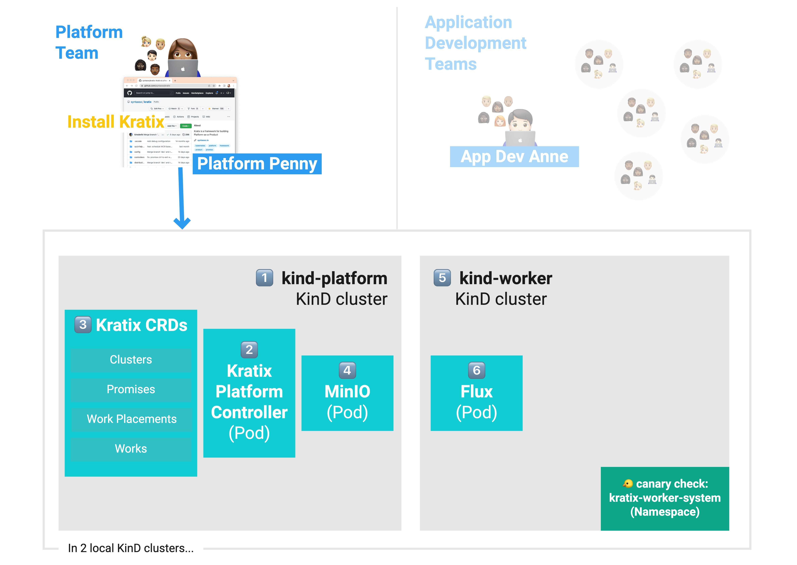

This is Part 1 of [a series](../README.md) illustrating how Kratix works. <br />
👉🏾&nbsp;&nbsp; Next: [Install a Kratix Promise](/installing-a-promise/)

<hr>

### In this tutorial, you will
* [learn more about Kratix as a framework](#what-is-kratix)
* [install a multi-cluster Kratix using KinD](#install-kratix)

# <a name="what-is-kratix"></a> What is Kratix?


Kratix is a framework used by platform teams to build the custom platforms tailored to their organisation.

### Using Kratix to build your platform you can:

* use GitOps workflow with Flux and familiar Kubernetes-native constructs.
* co-create capabilities by providing a clear contract between application and platform teams through the definition and creation of “Promises”. We'll talk more about Kratix Promises in [the next step](/installing-a-promise/README.md).
* create a flexible platform with your paved paths as Promises.
* evolve your platform easily as your business needs change. 
* start small on a laptop and expand to multi-team, multi-cluster, multi-region, and multi-cloud with a consistent API everywhere.

### Providing a Kratix-built platform allows your users to:
- discover available services that are already fit-for-purpose.
- consume services on demand using standard Kubernetes APIs.
- move focus away from infrastructure toward adding product value.

<br />
<hr>
<br />

Before you begin installing Kratix: 

## <a name="prerequisites"></a>System setup
For this workshop, we'll use Kratix on two local Kubernetes clusters. Install the prerequisites listed below if they aren't already on your system.

1. `kind` CLI / **Kubernetes-in-Docker(KinD)**: <br />
  Used to create and manage local Kubernetes clusters in Docker. <br />
  See [the quick start guide](https://kind.sigs.k8s.io/docs/user/quick-start/) to install.

1. `docker` CLI / **Docker**: <br />
  Used to orchestrate containers. `kind` (above) requires that you have Docker installed and configured. <br />
  See [Get Docker](https://docs.docker.com/get-docker/) to install.

1. `kubectl` / **Kubernetes command-line tool**: <br /> 
The CLI for Kubernetes&mdash;allows you to run commands against Kubernetes clusters.<br />
See [the install guide](https://kubernetes.io/docs/tasks/tools/#kubectl).

## <a name="delete-clusters"></a>Update your Docker resource allocations
In order to complete all tutorials in this series, you must allocate enough resources to Docker. Docker requires:<br /><br />
* 5 CPU
* 12GB Memory
* 4GB swap

This can be managed through your tool of choice (e.g. Docker Desktop, Rancher, etc).

## <a name="delete-clusters"></a>Delete existing Kratix KinD clusters

Ensure no clusters are currently running.

```bash
kind get clusters
```

The above command will give an output similar to
```console
No kind clusters found.
```

If you have clusters named `platform` or `worker` please delete them with
```bash
kind delete clusters platform worker
```

## <a name="clone-kratix"></a>Clone Kratix
Clone Kratix!

```bash
git clone https://github.com/syntasso/kratix.git
cd kratix
```
<br />

# Installation

Now that your system is set up for the workshop, you can install Kratix! You should be in the `kratix` folder.

### Steps
1. [Set up your `platform` cluster](#platform-setup)
1. [Adjust networking for KinD](#kind-networking), if required
1. [Set up your `worker` cluster](#worker-setup)
<br /><br />


<br /><br />

| Reference | Kratix&nbsp;installation&nbsp;component | Description |
| :---: | :--- | ----------- |
| 1️⃣ | `platform`&nbsp;&nbsp;cluster | The first of two local Kubernetes clusters that Kratix will use. This allows your platform to have orchestration logic separated from application workloads.  |
| 2️⃣ | `kratix`&#x2011;`platform`&#x2011;`controller`&nbsp;&nbsp;Pod  | At a _very_ high level, this manages the lifecycle of Kratix resources.  |
| 3️⃣ | Kratix CRDs  | A set of CRDs that Kratix requires. |
| 4️⃣ | An installation of [MinIO](https://min.io/) | [MinIO](https://min.io/) is a document store, which is what the Kratix `platform` cluster needs for storing generated resource definitions. MinIO is a local document storage that works well with KinD. Kratix can use any storage mechanism that speaks either S3 or Git.  |
| 5️⃣ | `worker` cluster | The second of two local Kubernetes clusters that Kratix will use. In this workshop, you run one single separate cluster to manage application workloads, but Kratix allows you to design the cluster architecture that makes sense in your context. |
| 6️⃣ | An installation of [Flux](https://fluxcd.io/) | Kratix uses GitOps workflow, and [Flux](https://fluxcd.io/) is the mechanism to continuously synchronise the `platform` and `worker` clusters. Flux uses the documents in the MinIO store for synchronisation. Similar to document storage, this workshop uses Flux, but Kratix can use any tool that follows the GitOps pattern of using repositories as the source of truth for defining desired Kubernetes state.  | 

<br />
Now that you know what the installation looks like, bring Kratix to life.
<br />

### <a name="platform-setup"></a>Set up your Kratix `platform` cluster

Create your `platform` cluster and install Kratix and MinIO.
```bash
kind create cluster --name platform
kubectl apply --filename distribution/kratix.yaml
kubectl apply --filename hack/platform/minio-install.yaml
```
<br />

Verify that the Kratix API is now available.
```bash
kubectl get crds
```

You should see something similar to
```console
NAME                                   CREATED AT
clusters.platform.kratix.io            2022-05-10T12:00:00Z
promises.platform.kratix.io            2022-05-10T12:00:00Z
workplacements.platform.kratix.io      2022-05-10T12:00:00Z
works.platform.kratix.io               2022-05-10T12:00:00Z
```
<br />

Verify Kratix and MinIO are installed and healthy.
```bash
kubectl --context kind-platform get pods --namespace kratix-platform-system
```

You should see something similar to
```console
NAME                                                  READY   STATUS       RESTARTS   AGE
kratix-platform-controller-manager-769855f9bb-8srtj   2/2     Running      0          1h
minio-6f75d9fbcf-5cn7w                                1/1     Running      0          1h
```
<br />

### <a name="kind-networking"></a>Adjust multi-cluster networking for KinD
Some KinD installations use non-standard networking. To ensure cross-cluster communication you need to run this script:

```bash
PLATFORM_CLUSTER_IP=`docker inspect platform-control-plane | grep '"IPAddress": "172' | awk '{print $2}' | awk -F '"' '{print $2}'`
sed -i'' -e "s/172.18.0.2/$PLATFORM_CLUSTER_IP/g" hack/worker/gitops-tk-resources.yaml
```
<br />

### <a name="worker-setup"></a>Set up your Kratix `worker` cluster

Create your Kratix `worker` cluster and install [Flux](https://fluxcd.io/). This will create a cluster for running the X as-a-Service workloads:
```bash
kind create cluster --name worker #Also switches kubectl context to worker
kubectl apply --filename config/samples/platform_v1alpha1_worker_cluster.yaml --context kind-platform #register the worker cluster with the platform cluster
kubectl apply --filename hack/worker/gitops-tk-install.yaml
kubectl apply --filename hack/worker/gitops-tk-resources.yaml
```
<br />

Verify Flux is installed and configured (i.e., Flux knows where in MinIO to look for resources to install).
```bash
kubectl --context kind-worker get buckets.source.toolkit.fluxcd.io --namespace flux-system
```

You should see something similar to
```console
NAME                        URL   READY   STATUS                                                       AGE
kratix-workload-crds              True    Fetched revision: 9343bf26ec16db995d7b53ff63c64b7dfb9789c4   1m
kratix-workload-resources         True    Fetched revision: f2d918e21d4c5cc65791d121f4a3375ad80a3eac   1m
```
<br />

Once Flux is installed and running, the Kratix resources will be visible on the `worker` cluster. 

Verify that you can deploy resources to `worker`&mdash;check if your "canary" resource has been deployed. This may take a few minutes so `--watch` will append updates to the bottom of the output.
```bash
kubectl --context kind-worker get namespaces --watch
```

You should see something similar to
```console
NAME                   STATUS   AGE
kratix-worker-system   Active   1m
default                Active   3m32s
flux-system            Active   3m23s
kube-node-lease        Active   3m33s
kube-public            Active   3m33s
kube-system            Active   3m33s
...
```
<br /> 

## Summary
You created a platform using Kratix. Well done!

To recap the steps we took:
1. ✅&nbsp;&nbsp;X

<br />


### 🎉 &nbsp; Congratulations!
✅&nbsp;&nbsp; Kratix is now installed. <br />
👉🏾&nbsp;&nbsp; Next you will [install an off-the-shelf Kratix Promise](/installing-a-promise/README.md).
