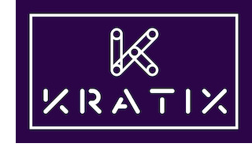

This is Part 1 of [a series](../README.md) illustrating how Kratix works. <br/>
👉🏾&nbsp;&nbsp; Next: [Quick Start: Install a Kratix Promise](/installing-a-promise/)

<hr>

### In this tutorial, you will
* [learn more about Kratix as a framework](#what-is-kratix)
* [install a multi-cluster Kratix using KinD](#install-kratix)

# <a name="what-is-kratix"></a> What is Kratix?



Kratix is a framework used by platform teams to build the custom platforms tailored to their organisation.

### Using Kratix to build your platform you can:

* use GitOps workflow and familiar Kubernetes-native constructs.
* co-create capabilities by providing a clear contract between application and platform teams through the definition and creation of “Promises”. We'll talk more about Kratix Promises in [the next step](/installing-a-promise/README.md).
* create a flexible platform with your Golden Paths as Promises.
* evolve your platform easily as your business needs change. 
* start small on a laptop and expand to multi-team, multi-cluster, multi-region, and multi-cloud with a consistent API everywhere.

### Providing a Kratix-built platform allows your users to:
- discover available services that are already fit-for-purpose.
- consume services on demand using standard Kubernetes APIs.
- move focus away from infrastructure toward adding product value.
<br><br>
Now that you know more about Kratix, follow the steps below to install Kratix locally.

<br>
<hr>
<br>

## <a name="install-kratix"></a> Quick Start: Install a multi-cluster Kratix using KinD

### Steps
1. [Complete pre-requistes](#prerequisites), if required
1. [Delete existing clusters](#delete-clusters), if required
1. [Clone Kratix](#clone-kratix)
1. [Set up your `platform` cluster](#platform-setup)
1. [Adjust networking for KinD](#kind-networking), if required
1. [Set up your `worker` cluster](#worker-setup)
1. [Verify installation](#verify-installation), if required


### <a name="prerequisites"></a>Prerequisites
1. **Kubernetes-in-Docker(KinD)**: <br/>
  See [the quick start guide](https://kind.sigs.k8s.io/docs/user/quick-start/) to install.

1. **kubectl**: see [the install guide](https://kubernetes.io/docs/tasks/tools/#kubectl).

1. A **Docker Hub account** with push permissions.

1. **[Docker CLI](https://docs.docker.com/get-docker/)** to build and push images.

1. In order to complete all tutorials in this series, you must allocate enough resources to Docker. Docker requires:<br><br>
5 CPU<br>
12GB Memory<br>
4GB swap<br><br>
This can be managed through your tool of choice (e.g. Docker Desktop, Rancher, etc).

###  <a name="delete-clusters"></a>Delete existing clusters

If you've already installed KinD, ensure no clusters are currently running.

```console
kind get clusters
```


The above command will give an output similar to
```console
No kind clusters found.
```

Delete any existing clusters
```console
kind delete <cluster(s) name(s)>
```
<br>

####  <a name="clone-kratix"></a>Clone Kratix
```console
git clone https://github.com/syntasso/kratix.git
cd kratix
```

### <a name="platform-setup"></a>Set up your `platform` cluster

Create your `platform` cluster and install Kratix.

```console
kind create cluster --name platform
kubectl apply -f distribution/kratix.yaml
kubectl apply -f hack/platform/minio-install.yaml
```

The Kratix API is now available.

```console
kubectl get crds
```

The above command will give an output similar to
```console
NAME                                   CREATED AT
clusters.platform.kratix.io            2022-05-10T11:10:57Z
promises.platform.kratix.io            2022-05-10T11:10:57Z
workplacements.platform.kratix.io      2022-05-10T11:10:57Z
works.platform.kratix.io               2022-05-10T11:10:57Z
```

### <a name="kind-networking"></a>Adjust multi-cluster networking for KinD
Some KinD installations use non-standard networking. To ensure cross-cluster communication you need to run this script:

```console
PLATFORM_CLUSTER_IP=`docker inspect platform-control-plane | grep '"IPAddress": "172' | awk '{print $2}' | awk -F '"' '{print $2}'`
sed -i'' -e "s/172.18.0.2/$PLATFORM_CLUSTER_IP/g" hack/worker/gitops-tk-resources.yaml
```

### <a name="worker-setup"></a>Set up your `worker` cluster
Create your `worker` cluster. This will create a cluster for running the X-as-a-service workloads:

```console
kind create cluster --name worker #Also switches kubectl context to worker
kubectl apply -f config/samples/platform_v1alpha1_worker_cluster.yaml --context kind-platform #register the worker cluster with the platform cluster
kubectl apply -f hack/worker/gitops-tk-install.yaml
kubectl apply -f hack/worker/gitops-tk-resources.yaml
```

Once Flux is installed and running (this may take a few minutes so `-w` will watch the output), the Kratix resources will be visible on the worker cluster.

```console
kubectl get ns -w
```

You should see something similar to
```console
NAME                   STATUS   AGE
kratix-worker-system   Active   4m2s
```

### <a name="verify-installation"></a>Verify installation

Not sure if you are properly set up? The list of commands below will validate whether your installation was successful

_To verify your have the two necessary clusters_

```console
kind get clusters
```

You should see something similar to
```console
platform
worker
```
<br/>

_To verify Kratix and MinIO are installed and healthy_

```console
kubectl --context kind-platform get pods --namespace kratix-platform-system
```

You should see something similar to
```console
NAME                                                  READY   STATUS       RESTARTS   AGE
kratix-platform-controller-manager-769855f9bb-8srtj   2/2     Running      0          1h
minio-6f75d9fbcf-5cn7w                                1/1     Running      0          1h
```
<br/>

_To verify the Kratix API is available_

```console
kubectl --context kind-platform get crds
```

You should see something similar to
```console
NAME                                   CREATED AT
clusters.platform.kratix.io            2022-05-10T11:10:57Z
promises.platform.kratix.io            2022-05-10T11:10:57Z
workplacements.platform.kratix.io      2022-05-10T11:10:57Z
works.platform.kratix.io               2022-05-10T11:10:57Z
```
<br/>

_To verify Flux is installed and running (i.e., Kratix resources are on the 'worker' cluster)_

```console
kubectl get ns kratix-worker-system
```

You should see something similar to
```console
NAME                   STATUS   AGE
kratix-worker-system   Active   4m2s
```
<br/>

_To verify you can deploy resources to the worker, check if your "canary" resource has been deployed_

```console
kubectl --context kind-worker get namespaces kratix-worker-system
```

You should see something similar to
```console
NAME                   STATUS   AGE
kratix-worker-system   Active   1h
```

<br> 

### 🎉 &nbsp; Congratulations!
✅&nbsp;&nbsp; Kratix is now installed. <br/>
👉🏾&nbsp;&nbsp; Next you will [install an off-the-shelf Kratix Promise](/installing-a-promise/README.md).
