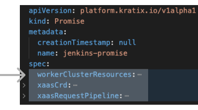

This is Part 4 of [a series](../README.md) illustrating how Kratix works. <br />
👈🏾&nbsp;&nbsp; Previous: [Using multiple Kratix Promises](/using-multiple-promises/) <br />
👉🏾&nbsp;&nbsp; Next: [Enhancing a Kratix Promise](/enhancing-a-promise/)

<hr>

### In this tutorial, you will
1. [learn more about what's inside a Kratix Promise](#inside-a-promise)
1. [write and install your own Kratix Promise](#write-promise-start)

# <a name="inside-a-promise"></a>What's inside a Kratix Promise?

You've [installed Kratix and three sample Promises](/using-multiple-promises/README.md). Now you'll create a Promise from scratch.

From [installing a Promise](/installing-a-promise/README.md), a Kratix Promise is a YAML document that defines a contract between the platform and its users. It is what allows platforms to be built incrementally.

### A Promise consists of three parts:

1. `xaasCrd`: the CRD that an application developer uses to request an instance of the Kratix Promise from the platform cluster.
1. `workerClusterResources`: a collection of Kubernetes resources that enable the creation of an instance and will be pre-installed in the worker clusters.
1. `xaasRequestPipeline`: an ordered list of docker containers that result in the creation an instance of the promised service on a worker cluster.

## Recap: basics of getting a promised instance to your users

At a very high level

* You talk to users of your platform to find out what they're using and what they need.
* You write a Kratix Promise for a service that your users and teams need.
  * In `xaasCrd`, you list what your users can configure in their request.
  * In `workerClusterResources`, you list what resources are required for Kratix to fulfil the Promise.
  * In `xaasRequestPipeline`, you list Docker images that will take the user's request and decorate it with configuration that you or the business require.
* You install the Promise on your platform cluster, where Kratix is installed.
* Your user wants an instance of the Promise.
* Your user submit a Kratix Resource Request that lists what they want and how they want it, and this complies with the `xaasCrd` (more details on this request later).
* Kratix fires off the request pipeline that you defined in `xaasRequestPipeline` and passes the Resource Request as an input.
* The pipeline outputs valid Kubernetes documents that say what the user wants and what the business wants for that Promise instance.
* The worker cluster has what it needs based on the `workerClusterResources` and is ready to create the instance when the request comes through.

## A Kratix Promise to deliver Jenkins

Imagine your platform team has received its fourth request from its fourth team for a Jenkins instance. You decide four times is too many times to manually set up Jenkins.

Now you'll write a Jenkins Promise and install it on your platform so that your four teams get Jenkins&mdash;and you get time back for more valuable work.

<br />
<hr>
<br />


## <a name="write-promise-start"></a>Writing your own Kratix Promise

### Steps

#### Define Promise
1. [Folder setup](#folder-setup)
1. [Generate a Promise template](#promise-template)

#### Promise definition: xaasCrd 
1. [X as-a-Service Custom Resource Definition: define your Promise API](#define-crd)

#### Promise definition: xaasRequestPipeline 
1. [Create your Promise instance base manifest](#base-instance)
1. [Build a simple request pipeline](#pipeline-script)
1. [Package your pipeline step as a Docker image](#dockerfile)
1. [Test your container image](#test-image)

#### Promise definition: workerClusterResources
1. [Define your `workerClusterResources` in your Promise definition](#worker-cluster-resources)

#### Test Promise
1. [Prepare your environment](#prepare-your-environment), if required
1. [Install your Promise](#install-promise)
1. [Create and submit a Kratix Resource Request](#create-resource-request)
1. [Review of a Kratix Promise parts (in detail)](#promise-review)
1. [Summary](#summary)
1. [Tear down your environment](#teardown)


### <a name="folder-setup"></a>Folder setup

To begin writing a Promise you will need a basic directory structure to work in. You can generate this folder structure in any local directory by running

```bash
mkdir -p jenkins-promise/{resources,request-pipeline-image}
cd jenkins-promise
```

Below should now represent how your directory is organised and your current working directory with the 👩🏾‍💻 icon

<!-- 👩🏾‍💻 emoji is equivelant spacing to 4 &nbsp; -->
👩🏾‍💻 . 📂 jenkins-promise<br />
&nbsp;&nbsp;&nbsp;&nbsp;&nbsp;&nbsp;&nbsp;&nbsp;|&mdash;📂 request-pipeline-image<br />
&nbsp;&nbsp;&nbsp;&nbsp;&nbsp;&nbsp;&nbsp;&nbsp;\`&mdash;📂 resources<br />

### <a name="promise-template"></a>Generate a Promise template

Generate a basic `jenkins-promise-template.yaml` to work with
```bash
cat > jenkins-promise-template.yaml <<EOF
apiVersion: platform.kratix.io/v1alpha1
kind: Promise
metadata:
  name: jenkins-promise
spec:
  #injected via: go run path/to/kratix/hack/worker-resource-builder/main.go -k8s-resources-directory ${PWD}/resources -promise ${PWD}/jenkins-promise-template.yaml > jenkins-promise.yaml
  #workerClusterResources:
  xaasRequestPipeline:
  xaasCrd:
EOF
```
<br />

<!-- 👩🏾‍💻 emoji is equivelant spacing to 4 &nbsp; -->
👩🏾‍💻 . 📂 jenkins-promise<br />
&nbsp;&nbsp;&nbsp;&nbsp;&nbsp;&nbsp;&nbsp;&nbsp;|&mdash;📂 request-pipeline-image<br />
&nbsp;&nbsp;&nbsp;&nbsp;&nbsp;&nbsp;&nbsp;&nbsp;|&mdash;📂 resources<br />
&nbsp;&nbsp;&nbsp;&nbsp;&nbsp;&nbsp;&nbsp;&nbsp;\`&mdash; 🆕 jenkins-promise-template.yaml

You will fill in the fields under `spec` as you progress through the tutorial.

### <a name="define-crd"></a>X-as-a-Service Custom Resource Definition: define your Promise API
For the purpose of this tutorial, you will create an API that accepts a single `string` parameter called `name`. This API can be as complex or as simple as you design it to be.

Replace the `xaasCrd` field in `jenkins-promise-template.yaml` with the complete field details below. Ensure the indentation is correct (`xaasCrd` is nested under `spec`).

```yaml
  xaasCrd:
    apiVersion: apiextensions.k8s.io/v1
    kind: CustomResourceDefinition
    metadata:
      name: jenkins.example.promise.syntasso.io
    spec:
      group: example.promise.syntasso.io
      scope: Namespaced
      names:
        plural: jenkins
        singular: jenkins
        kind: jenkins
      versions:
      - name: v1
        served: true
        storage: true
        schema:
          openAPIV3Schema:
            type: object
            properties:
              spec:
                type: object
                properties:
                  name:
                    type: string
```

You have now created the as-a-Service API.

### <a name="base-instance"></a>Create your Promise instance base manifest

Next build the pipeline to use details from a Kratix Promise _Resource Request_ into the Kubernetes resources required to create a running instance of the Jenkins service.

```bash
cd request-pipeline-image
```

<!-- 👩🏾‍💻 emoji is equivelant spacing to 4 &nbsp; -->
&nbsp;&nbsp;&nbsp;&nbsp;. 📂 jenkins-promise<br />
👩🏾‍💻&nbsp;&nbsp;&nbsp;&nbsp;|&mdash;📂 request-pipeline-image<br />
&nbsp;&nbsp;&nbsp;&nbsp;&nbsp;&nbsp;&nbsp;&nbsp;|&mdash;📂 resources<br />
&nbsp;&nbsp;&nbsp;&nbsp;&nbsp;&nbsp;&nbsp;&nbsp;\`&mdash; jenkins-promise-template.yaml

Create the <code>jenkins-instance.yaml</code> base manifest file that the pipeline will transform.

<details>
  <summary>👀&nbsp;&nbsp;<strong>CLICK HERE</strong> to expand the code you need to create the <code>jenkins-instance.yaml</code> file.</summary>

```bash
cat > jenkins-instance.yaml <<EOF
apiVersion: jenkins.io/v1alpha2
kind: Jenkins
metadata:
  name: <tbr-name>
  namespace: default
spec:
  configurationAsCode:
    configurations: []
    secret:
      name: ""
  groovyScripts:
    configurations: []
    secret:
      name: ""
  jenkinsAPISettings:
    authorizationStrategy: createUser
  master:
    basePlugins:
    - name: kubernetes
      version: "1.31.3"
    - name: workflow-job
      version: "1180.v04c4e75dce43"
    - name: workflow-aggregator
      version: "2.7"
    - name: git
      version: "4.11.0"
    - name: job-dsl
      version: "1.79"
    - name: configuration-as-code
      version: "1414.v878271fc496f"
    - name: kubernetes-credentials-provider
      version: "0.20"
    disableCSRFProtection: false
    containers:
      - name: jenkins-master
        image: jenkins/jenkins:2.332.2-lts
        imagePullPolicy: Always
        livenessProbe:
          failureThreshold: 12
          httpGet:
            path: /login
            port: http
            scheme: HTTP
          initialDelaySeconds: 100
          periodSeconds: 10
          successThreshold: 1
          timeoutSeconds: 5
        readinessProbe:
          failureThreshold: 10
          httpGet:
            path: /login
            port: http
            scheme: HTTP
          initialDelaySeconds: 80
          periodSeconds: 10
          successThreshold: 1
          timeoutSeconds: 1
        resources:
          limits:
            cpu: 1500m
            memory: 3Gi
          requests:
            cpu: "1"
            memory: 500Mi
EOF
```
</details>

<!-- 👩🏾‍💻 emoji is equivelant spacing to 4 &nbsp; -->
&nbsp;&nbsp;&nbsp;&nbsp;. 📂 jenkins-promise<br />
👩🏾‍💻&nbsp;&nbsp;&nbsp;&nbsp;|&mdash;📂 request-pipeline-image<br />
&nbsp;&nbsp;&nbsp;&nbsp;&nbsp;&nbsp;&nbsp;&nbsp;|&nbsp;&nbsp;&nbsp;&nbsp;\`&mdash; jenkins-instance.yaml<br />
&nbsp;&nbsp;&nbsp;&nbsp;&nbsp;&nbsp;&nbsp;&nbsp;|&mdash;📂 resources<br />
&nbsp;&nbsp;&nbsp;&nbsp;&nbsp;&nbsp;&nbsp;&nbsp;\`&mdash; 🆕 jenkins-promise-template.yaml

### <a name="pipeline-script"></a>Build a simple request pipeline

Kratix takes no opinion on the tooling used within a pipeline. Kratix will pass a set of resources to the pipeline, and expect back a set of resources. What happens within the pipeline, and what tooling is used, is a decision left entirely to you.

For this example, you're taking a name from the Kratix Resource Request for an instance and passing it to the Jenkins custom resource output.

To keep this transformation simple, you'll use a combination of `sed` and `yq` to do the work.

Create a script file that will execute when the pipeline runs.
```bash
cat > execute-pipeline.sh <<EOF
#!/bin/sh

set -x

#Get the name from the Promise Custom resource
instanceName=\$(yq eval '.spec.name' /input/object.yaml)

# Inject the name into the Jenkins resources
find /tmp/transfer -type f -exec sed -i \\
  -e "s/<tbr-name>/\${instanceName//\//\\/}/g" \\
  {} \;

cp /tmp/transfer/* /output/
EOF
```
<br />

Your file directory should now include the new file as shown below

<!-- 👩🏾‍💻 emoji is equivelant spacing to 4 &nbsp; -->
&nbsp;&nbsp;&nbsp;&nbsp;. 📂 jenkins-promise<br />
👩🏾‍💻&nbsp;&nbsp;&nbsp;&nbsp;|&mdash;📂 request-pipeline-image<br />
&nbsp;&nbsp;&nbsp;&nbsp;&nbsp;&nbsp;&nbsp;&nbsp;|&nbsp;&nbsp;&nbsp;&nbsp;|&mdash; 🆕 execute-pipeline.sh<br />
&nbsp;&nbsp;&nbsp;&nbsp;&nbsp;&nbsp;&nbsp;&nbsp;|&nbsp;&nbsp;&nbsp;&nbsp;\`&mdash; jenkins-instance.yaml<br />
&nbsp;&nbsp;&nbsp;&nbsp;&nbsp;&nbsp;&nbsp;&nbsp;|&mdash;📂 resources<br />
&nbsp;&nbsp;&nbsp;&nbsp;&nbsp;&nbsp;&nbsp;&nbsp;\`&mdash; jenkins-promise-template.yaml

Then make it executable:
```bash
chmod +x execute-pipeline.sh
```
<br />


### <a name="dockerfile"></a>Package your pipeline step as a Docker image

Run the code below, to create your `Dockerfile`
```bash
cat > Dockerfile <<EOF
FROM "mikefarah/yq:4"
RUN [ "mkdir", "/tmp/transfer" ]

ADD jenkins-instance.yaml /tmp/transfer/jenkins-instance.yaml
ADD execute-pipeline.sh execute-pipeline.sh

CMD [ "sh", "-c", "./execute-pipeline.sh"]
ENTRYPOINT []
EOF
```
<br />

Your file directory should now include the new file as shown below

<!-- 👩🏾‍💻 emoji is equivelant spacing to 4 &nbsp; -->
&nbsp;&nbsp;&nbsp;&nbsp;. 📂 jenkins-promise<br />
👩🏾‍💻&nbsp;&nbsp;&nbsp;&nbsp;|&mdash;📂 request-pipeline-image<br />
&nbsp;&nbsp;&nbsp;&nbsp;&nbsp;&nbsp;&nbsp;&nbsp;|&nbsp;&nbsp;&nbsp;&nbsp;|&mdash; 🆕 Dockerfile<br />
&nbsp;&nbsp;&nbsp;&nbsp;&nbsp;&nbsp;&nbsp;&nbsp;|&nbsp;&nbsp;&nbsp;&nbsp;|&mdash; execute-pipeline.sh<br />
&nbsp;&nbsp;&nbsp;&nbsp;&nbsp;&nbsp;&nbsp;&nbsp;|&nbsp;&nbsp;&nbsp;&nbsp;\`&mdash; jenkins-instance.yaml<br />
&nbsp;&nbsp;&nbsp;&nbsp;&nbsp;&nbsp;&nbsp;&nbsp;|&mdash;📂 resources<br />
&nbsp;&nbsp;&nbsp;&nbsp;&nbsp;&nbsp;&nbsp;&nbsp;\`&mdash; jenkins-promise-template.yaml

Next build your Docker image. You will later load the image to the KinD local cache, so there's no need to replace the image tag:
```bash
docker build . --tag kratix-workshop/jenkins-request-pipeline:dev
```

### <a name="test-image"></a>Test your Docker container image

Test the Docker container image by supplying an input resource and examining the output resource.

Create the test input and output directories locally within the `request-pipeline-image` directory:

```bash
mkdir {input,output}
```

Your file directory should now include the new file as shown below

<!-- 👩🏾‍💻 emoji is equivelant spacing to 4 &nbsp; -->
&nbsp;&nbsp;&nbsp;&nbsp;. 📂 jenkins-promise<br />
👩🏾‍💻&nbsp;&nbsp;&nbsp;&nbsp;|&mdash;📂 request-pipeline-image<br />
&nbsp;&nbsp;&nbsp;&nbsp;&nbsp;&nbsp;&nbsp;&nbsp;|&nbsp;&nbsp;&nbsp;&nbsp;|&mdash;📂  🆕 input<br />
&nbsp;&nbsp;&nbsp;&nbsp;&nbsp;&nbsp;&nbsp;&nbsp;|&nbsp;&nbsp;&nbsp;&nbsp;|&mdash;📂  🆕 output<br />
&nbsp;&nbsp;&nbsp;&nbsp;&nbsp;&nbsp;&nbsp;&nbsp;|&nbsp;&nbsp;&nbsp;&nbsp;|&mdash; Dockerfile<br />
&nbsp;&nbsp;&nbsp;&nbsp;&nbsp;&nbsp;&nbsp;&nbsp;|&nbsp;&nbsp;&nbsp;&nbsp;|&mdash; execute-pipeline.sh<br />
&nbsp;&nbsp;&nbsp;&nbsp;&nbsp;&nbsp;&nbsp;&nbsp;|&nbsp;&nbsp;&nbsp;&nbsp;\`&mdash; jenkins-instance.yaml<br />
&nbsp;&nbsp;&nbsp;&nbsp;&nbsp;&nbsp;&nbsp;&nbsp;|&mdash;📂 resources<br />
&nbsp;&nbsp;&nbsp;&nbsp;&nbsp;&nbsp;&nbsp;&nbsp;\`&mdash; jenkins-promise-template.yaml

The `/input` directory is where your incoming Kratix Resource Request will be written when a user wants an instance.

Create a sample Resource Request to the `/input` directory without changing your current working directory by running

```bash
cat > input/object.yaml <<EOF
apiVersion: promise.example.com/v1
kind: jenkins
metadata:
  name: my-jenkins-promise-request
spec:
  name: my-amazing-jenkins
EOF
```
<br />

<!-- 👩🏾‍💻 emoji is equivelant spacing to 4 &nbsp; -->
&nbsp;&nbsp;&nbsp;&nbsp;. 📂 jenkins-promise<br />
👩🏾‍💻&nbsp;&nbsp;&nbsp;&nbsp;|&mdash;📂 request-pipeline-image<br />
&nbsp;&nbsp;&nbsp;&nbsp;&nbsp;&nbsp;&nbsp;&nbsp;|&nbsp;&nbsp;&nbsp;&nbsp;|&mdash;📂  input<br />
&nbsp;&nbsp;&nbsp;&nbsp;&nbsp;&nbsp;&nbsp;&nbsp;|&nbsp;&nbsp;&nbsp;&nbsp;|&nbsp;&nbsp;&nbsp;&nbsp;\`&mdash; 🆕 object.yaml<br />
&nbsp;&nbsp;&nbsp;&nbsp;&nbsp;&nbsp;&nbsp;&nbsp;|&nbsp;&nbsp;&nbsp;&nbsp;|&mdash;📂  output<br />
&nbsp;&nbsp;&nbsp;&nbsp;&nbsp;&nbsp;&nbsp;&nbsp;|&nbsp;&nbsp;&nbsp;&nbsp;|&mdash; Dockerfile<br />
&nbsp;&nbsp;&nbsp;&nbsp;&nbsp;&nbsp;&nbsp;&nbsp;|&nbsp;&nbsp;&nbsp;&nbsp;|&mdash; execute-pipeline.sh<br />
&nbsp;&nbsp;&nbsp;&nbsp;&nbsp;&nbsp;&nbsp;&nbsp;|&nbsp;&nbsp;&nbsp;&nbsp;\`&mdash; jenkins-instance.yaml<br />
&nbsp;&nbsp;&nbsp;&nbsp;&nbsp;&nbsp;&nbsp;&nbsp;|&mdash;📂 resources<br />
&nbsp;&nbsp;&nbsp;&nbsp;&nbsp;&nbsp;&nbsp;&nbsp;\`&mdash; jenkins-promise-template.yaml


Run the container and examine the output
```bash
docker run -v ${PWD}/input:/input -v ${PWD}/output:/output kratix-workshop/jenkins-request-pipeline:dev
```
<br />

The contents of the `/output` directory will be scheduled and deployed by Kratix to a worker cluster. They need to be valid Kubernetes resources that can be applied to any cluster with the Promise's `workerClusterResources` installed (see beneath).

<!-- 👩🏾‍💻 emoji is equivelant spacing to 4 &nbsp; -->
&nbsp;&nbsp;&nbsp;&nbsp;. 📂 jenkins-promise<br />
👩🏾‍💻&nbsp;&nbsp;&nbsp;&nbsp;|&mdash;📂 request-pipeline-image<br />
&nbsp;&nbsp;&nbsp;&nbsp;&nbsp;&nbsp;&nbsp;&nbsp;|&nbsp;&nbsp;&nbsp;&nbsp;|&mdash;📂  input<br />
&nbsp;&nbsp;&nbsp;&nbsp;&nbsp;&nbsp;&nbsp;&nbsp;|&nbsp;&nbsp;&nbsp;&nbsp;|&nbsp;&nbsp;&nbsp;&nbsp;\`&mdash; object.yaml<br />
&nbsp;&nbsp;&nbsp;&nbsp;&nbsp;&nbsp;&nbsp;&nbsp;|&nbsp;&nbsp;&nbsp;&nbsp;|&mdash;📂  output<br />
&nbsp;&nbsp;&nbsp;&nbsp;&nbsp;&nbsp;&nbsp;&nbsp;|&nbsp;&nbsp;&nbsp;&nbsp;|&nbsp;&nbsp;&nbsp;&nbsp;\`&mdash; 🆕 jenkins_instance.yaml<br />
&nbsp;&nbsp;&nbsp;&nbsp;&nbsp;&nbsp;&nbsp;&nbsp;|&nbsp;&nbsp;&nbsp;&nbsp;|&mdash; Dockerfile<br />
&nbsp;&nbsp;&nbsp;&nbsp;&nbsp;&nbsp;&nbsp;&nbsp;|&nbsp;&nbsp;&nbsp;&nbsp;|&mdash; execute-pipeline.sh<br />
&nbsp;&nbsp;&nbsp;&nbsp;&nbsp;&nbsp;&nbsp;&nbsp;|&nbsp;&nbsp;&nbsp;&nbsp;\`&mdash; jenkins-instance.yaml<br />
&nbsp;&nbsp;&nbsp;&nbsp;&nbsp;&nbsp;&nbsp;&nbsp;|&mdash;📂 resources<br />
&nbsp;&nbsp;&nbsp;&nbsp;&nbsp;&nbsp;&nbsp;&nbsp;\`&mdash; jenkins-promise-template.yaml<br />

Once you are satisified with the image, load it to the local KinD cache:
```bash
kind load docker-image kratix-workshop/jenkins-request-pipeline:dev --name platform
```
<br />

The final step of creating the `xaasRequestPipeline` is to reference your docker image from the `spec.xaasRequestPipeline` field in the `jenkins-promise-template.yaml`.

Go back to the `jenkins-promise` directory.

```bash
cd ..
```

Add the image to the array in `jenkins-promise-template.yaml`.
```yaml
xaasRequestPipeline:
- kratix-workshop/jenkins-request-pipeline:dev
```
<br />

In summary, you have:
- Created a container image containing:
    - A template file to be injected with per-instance details (`jenkins-instance.yaml`)
    - A shell script to retrieve the per-instance details from the user's request, and inject them into the template (`execute-pipeline.sh`)
    - A command set to the shell script
- Created a set of directories(`input`/`output`) and sample user request(`input/object.yaml`)
- Executed the pipeline image locally as a test
- Pushed the image to the registry
- Added the image to the Promise definition in the `xaasRequestPipeline` array


### <a name="worker-cluster-resources"><a>Define your `workerClusterResources` in your Promise definition

The `workerClusterResources` describes everything required to fulfil the Promise. Kratix applies this content on all registered worker clusters.

For this Promise, the `workerClusterResources` needs to contain the Jenkins CRD, the Jenkins Operator, and the resources the Operator requires.

We now need to return to the `jenkins-promise` directory as shown below:

<!-- 👩🏾‍💻 emoji is equivelant spacing to 4 &nbsp; -->
👩🏾‍💻 . 📂 jenkins-promise<br />
&nbsp;&nbsp;&nbsp;&nbsp;&nbsp;&nbsp;&nbsp;&nbsp;|&mdash;📂 request-pipeline-image<br />
&nbsp;&nbsp;&nbsp;&nbsp;&nbsp;&nbsp;&nbsp;&nbsp;|&nbsp;&nbsp;&nbsp;&nbsp;|&mdash;📂  input<br />
&nbsp;&nbsp;&nbsp;&nbsp;&nbsp;&nbsp;&nbsp;&nbsp;|&nbsp;&nbsp;&nbsp;&nbsp;|&nbsp;&nbsp;&nbsp;&nbsp;\`&mdash; object.yaml<br />
&nbsp;&nbsp;&nbsp;&nbsp;&nbsp;&nbsp;&nbsp;&nbsp;|&nbsp;&nbsp;&nbsp;&nbsp;|&mdash;📂  output<br />
&nbsp;&nbsp;&nbsp;&nbsp;&nbsp;&nbsp;&nbsp;&nbsp;|&nbsp;&nbsp;&nbsp;&nbsp;|&nbsp;&nbsp;&nbsp;&nbsp;\`&mdash; jenkins_instance.yaml<br />
&nbsp;&nbsp;&nbsp;&nbsp;&nbsp;&nbsp;&nbsp;&nbsp;|&nbsp;&nbsp;&nbsp;&nbsp;|&mdash; Dockerfile<br />
&nbsp;&nbsp;&nbsp;&nbsp;&nbsp;&nbsp;&nbsp;&nbsp;|&nbsp;&nbsp;&nbsp;&nbsp;|&mdash; execute-pipeline.sh<br />
&nbsp;&nbsp;&nbsp;&nbsp;&nbsp;&nbsp;&nbsp;&nbsp;|&nbsp;&nbsp;&nbsp;&nbsp;\`&mdash; jenkins-instance.yaml<br />
&nbsp;&nbsp;&nbsp;&nbsp;&nbsp;&nbsp;&nbsp;&nbsp;|&mdash;📂 resources<br />
&nbsp;&nbsp;&nbsp;&nbsp;&nbsp;&nbsp;&nbsp;&nbsp;\`&mdash; jenkins-promise-template.yaml<br />

Once here, run the following command:

```bash
mkdir -p resources
curl https://raw.githubusercontent.com/jenkinsci/kubernetes-operator/fbea1ed790e7a9deb2311e1f565ee93f07d89022/config/crd/bases/jenkins.io_jenkins.yaml --output resources/jenkins.io_jenkins.yaml --silent
curl https://raw.githubusercontent.com/jenkinsci/kubernetes-operator/8fee7f2806c363a5ceae569a725c17ef82ff2b58/deploy/all-in-one-v1alpha2.yaml --output resources/all-in-one-v1alpha2.yaml --silent
```
<br />

The script will download the necessary files in the `resources` directory. You are now ready to inject the Jenkins files into the `jenkins-promise-template.yaml`.

To make this step simpler we have written a _very basic_ tool to grab all YAML documents from all YAML files located in `resources` and inject them into the `workerClusterResources` field.

To use this tool, you will need to download the correct binary for your computer from [GitHub releases](https://github.com/syntasso/kratix/releases/tag/v0.0.1):

```bash
curl -sLo worker-resource-builder https://github.com/syntasso/kratix/releases/download/v0.0.1/worker-resource-builder-v0.0.0-1-"$(uname -s)"-"$(uname -m)"
chmod +x worker-resource-builder
```

```bash
./worker-resource-builder \
  -k8s-resources-directory ./resources \
  -promise ./jenkins-promise-template.yaml > ./jenkins-promise.yaml
```
<br />

This created your finished Promise definition, `jenkins-promise.yaml`.


### <a name="prepare-your-environment"></a>Prepare your environment

You need a fresh installation of Kratix for this section. The simplest way to do so is by running the quick-start script. This script is found in the kratix directory as seen here:

<!-- 👩🏾‍💻 emoji is equivelant spacing to 4 &nbsp; -->
👩🏾‍💻. <a href="https://github.com/syntasso/kratix">📂 kratix</a><br />
&nbsp;&nbsp;&nbsp;&nbsp;&nbsp;&nbsp;&nbsp;&nbsp;|&mdash; ...<br />
&nbsp;&nbsp;&nbsp;&nbsp;&nbsp;&nbsp;&nbsp;&nbsp;\`&mdash;📂 scripts<br />
&nbsp;&nbsp;&nbsp;&nbsp;&nbsp;&nbsp;&nbsp;&nbsp;&nbsp;&nbsp;&nbsp;&nbsp;&nbsp;\`&mdash;📂 quick-start.sh<br />

```bash
./scripts/quick-start.sh --recreate
```

Alternatively, you can go back to the first step on this series: [Install Kratix across two KinD clusters](/installing-kratix/).
<br />

### <a name="install-promise"></a>Install your Promise

From back in your Promise directory, install the Promise in Kratix.

<!-- 👩🏾‍💻 emoji is equivelant spacing to 4 &nbsp; -->
👩🏾‍💻 . 📂 jenkins-promise<br />
&nbsp;&nbsp;&nbsp;&nbsp;&nbsp;&nbsp;&nbsp;&nbsp;|&mdash;📂 request-pipeline-image<br />
&nbsp;&nbsp;&nbsp;&nbsp;&nbsp;&nbsp;&nbsp;&nbsp;|&nbsp;&nbsp;&nbsp;&nbsp;|&mdash;📂  input<br />
&nbsp;&nbsp;&nbsp;&nbsp;&nbsp;&nbsp;&nbsp;&nbsp;|&nbsp;&nbsp;&nbsp;&nbsp;|&nbsp;&nbsp;&nbsp;&nbsp;\`&mdash; object.yaml<br />
&nbsp;&nbsp;&nbsp;&nbsp;&nbsp;&nbsp;&nbsp;&nbsp;|&nbsp;&nbsp;&nbsp;&nbsp;|&mdash;📂  output<br />
&nbsp;&nbsp;&nbsp;&nbsp;&nbsp;&nbsp;&nbsp;&nbsp;|&nbsp;&nbsp;&nbsp;&nbsp;|&nbsp;&nbsp;&nbsp;&nbsp;\`&mdash; jenkins_instance.yaml<br />
&nbsp;&nbsp;&nbsp;&nbsp;&nbsp;&nbsp;&nbsp;&nbsp;|&nbsp;&nbsp;&nbsp;&nbsp;|&mdash; Dockerfile<br />
&nbsp;&nbsp;&nbsp;&nbsp;&nbsp;&nbsp;&nbsp;&nbsp;|&nbsp;&nbsp;&nbsp;&nbsp;|&mdash; execute-pipeline.sh<br />
&nbsp;&nbsp;&nbsp;&nbsp;&nbsp;&nbsp;&nbsp;&nbsp;|&nbsp;&nbsp;&nbsp;&nbsp;\`&mdash; jenkins-instance.yaml<br />
&nbsp;&nbsp;&nbsp;&nbsp;&nbsp;&nbsp;&nbsp;&nbsp;|&mdash;📂 resources<br />
&nbsp;&nbsp;&nbsp;&nbsp;&nbsp;&nbsp;&nbsp;&nbsp;\`&mdash; jenkins-promise-template.yaml<br />


```
kubectl apply --context kind-platform --filename jenkins-promise.yaml
```
<br />

Verify the Promise installed<br/>
<sub>(This may take a few minutes so `--watch` will watch the command)</sub>
```bash
kubectl --context kind-platform get crds --watch
```
<br />

The above command will give an output similar to
```console
NAME                                  CREATED AT
jenkins.example.promise.syntasso.io   2021-09-09T11:21:10Z
```
<br />

Verify the Jenkins Operator is running<br/>
<sub>(This may take a few minutes so `--watch` will watch the command)</sub>
```bash
kubectl --context=kind-worker get pods --all-namespaces --watch
```
<br />

### <a name="create-resource-request"></a>Create and submit a Kratix Resource Request

You can now request instances of Jenkins.
```bash
cat > jenkins-resource-request.yaml <<EOF
apiVersion: example.promise.syntasso.io/v1
kind: jenkins
metadata:
  name: my-jenkins-promise-request
spec:
  name: my-amazing-jenkins
EOF

kubectl apply --context kind-platform --filename jenkins-resource-request.yaml
```
<br />

Applying the Kratix Promise will trigger your pipeline steps which in turn requests an instance of Jenkins from the operator. While the pipeline can run quite quickly, Jenkins requires quite a few resources to be installed including a deployment and a runner which means the full install may take a few minutes.

You can see a bit of what is happening by first looking for your pipeline completion
```bash
kubectl --context kind-platform get pods
```
<br />

This should result in something similar to
```console
NAME                                             READY   STATUS      RESTARTS   AGE
request-pipeline-jenkins-promise-default-9d40b   0/1     Completed   0          1m
```
<br />

For more details, you can view the pipeline logs with
```bash
kubectl --context kind-platform logs --selector kratix-promise-id=jenkins-promise-default --container xaas-request-pipeline-stage-1
```
<br />

This should result in something like
```console
+ yq eval .spec.name /input/object.yaml
+ instanceName=my-amazing-jenkins
+ find /tmp/transfer -type f -exec sed -i -e 's/<tbr-name>/my-amazing-jenkins/g' '{}' ';'
+ cp /tmp/transfer/jenkins-instance.yaml /output/
```

Then you can watch for the creation of your Jenkins instance by targeting the worker cluster:
```bash
kubectl --context kind-worker get pods --all-namespaces --watch
```
<br />

The above command will give an output similar to
```console
NAME                                READY   STATUS    RESTARTS   AGE
jenkins-my-amazing-jenkins          1/1     Running   0          1m
...
```
<br />

For verification, access the Jenkins UI in a browser, as in [previous steps](/installing-a-promise/README.md).

<br />

Port forward for browser access to the Jenkins UI
```bash
kubectl --context kind-worker port-forward jenkins-my-amazing-jenkins 8080:8080
```
<br />

Navigate to http://localhost:8080 and log in with the credentials you copy from the below commands.

<br />

Copy and paste the Jenkins username into the login page
```bash
kubectl --context kind-worker get secret jenkins-operator-credentials-my-amazing-jenkins -o 'jsonpath={.data.user}' | base64 -d
```
<br />

Copy and paste the Jenkins password into the login page
```bash
kubectl --context kind-worker get secret jenkins-operator-credentials-my-amazing-jenkins -o 'jsonpath={.data.password}' | base64 -d
```
<br />

### <a name="promise-review"></a>Review of a Kratix Promise parts (in detail)

#### `xaasCrd`
The `xaasCrd` is your user-facing API for the Promise. It defines the options that users can configure when they request the Promise. The complexity of the `xaasCrd` API is up to you. You can read more about writing Custom Resource Definitions in the [Kubernetes docs](https://kubernetes.io/docs/tasks/extend-kubernetes/custom-resources/custom-resource-definitions/#create-a-customresourcedefinition).

#### `workerClusterResources`
The `workerClusterResources` describes everything required to fulfil the Promise. Kratix applies this content on all registered worker clusters. For instance with the Jenkins Promise, the `workerClusterResources` contains the Jenkins CRD, the Jenkins Operator, and the resources the Operator requires.

### `xaasRequestPipeline`
The `xaasRequestPipeline` defines a set of jobs to run when Kratix receives a request for an instance of one of its Promises.

The pipeline is an array of Docker images, and those images are executed in order. The pipeline enables you to write Promises with specialised images and combine those images as needed.

#### How the pipeline works

Each container in the `xaasRequestPipeline` array will output complete, valid Kubernetes resources.

The contract with each pipeline container is simple and straightforward:
* The first container in the list receives the resource document created by the user's request&mdash;this request will comply with the `xaasCrd` described above. The document is available to the pipeline in `/input/object.yaml`.
* The container's command then executes with the input object and fulfils its responsibilites.
* The container writes any resources to be created to `/output/`.
* The resources in `/output` of the last container in the `xaasRequestPipeline` array will be scheduled and applied to the appropriate worker clusters.


## <a name="summary"></a>Summary
You have now authored your firs promise. Congratulations 🎉

To recap the steps we took:
1. ✅&nbsp;&nbsp;Generated a Kratix Promise template
1. ✅&nbsp;&nbsp;`xaasCrd`: Defined your Promise API with a X as-a-Service Custom Resource Definition
1. ✅&nbsp;&nbsp;Created your Promise instance base manifest
1. ✅&nbsp;&nbsp;`xaasRequestPipeline`: Built a simple request pipeline
1. ✅&nbsp;&nbsp;Packaged the pipeline as a Docker image
1. ✅&nbsp;&nbsp;Tested the pipeline Docker image
1. ✅&nbsp;&nbsp;`workerClusterResources`: Defined what needs to be present on your worker clusters to fulfil this Promise
1. ✅&nbsp;&nbsp;Installed your Kratix Promise
1. ✅&nbsp;&nbsp;Created and submitted a Kratix Resource Request
1. ✅&nbsp;&nbsp;Reviewed the components of a Promise

### <a name="teardown"></a>Tearing it all down

The next section in this tutorial requires a clean Kratix installation. Before heading to it, please clean up your environment by running:

```bash
kind delete clusters platform worker
```
<br />

### 🎉 &nbsp; Congratulations!
✅&nbsp;&nbsp; You have written a Kratix Promise. <br />
👉🏾&nbsp;&nbsp; Let's [see how to tailor Kratix Promises based on organisational context](/enhancing-a-promise/README.md).
